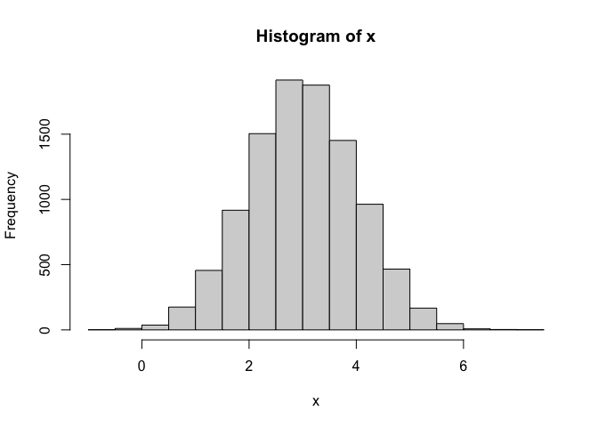
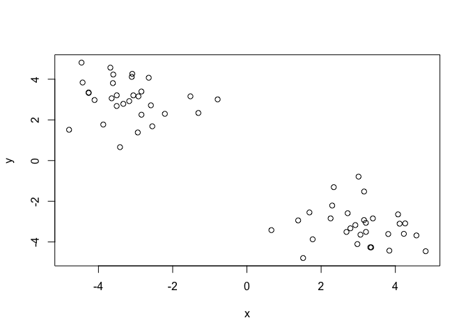
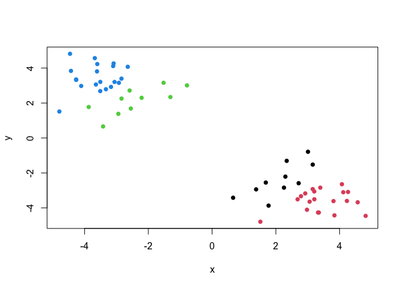
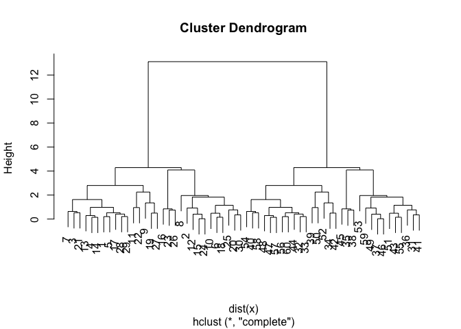
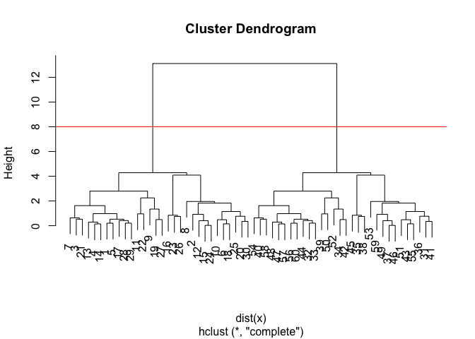
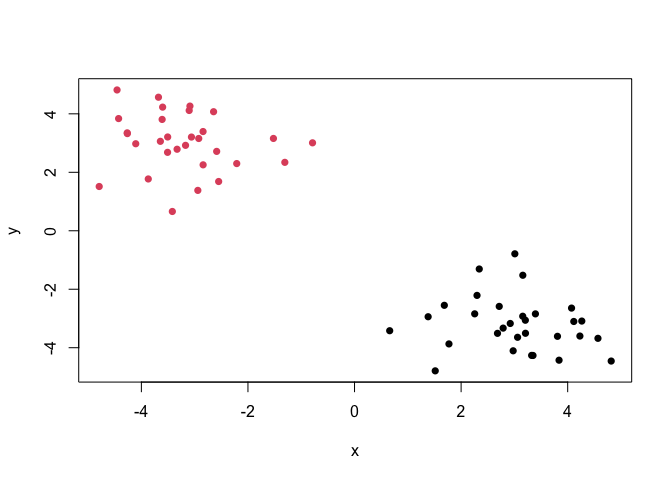
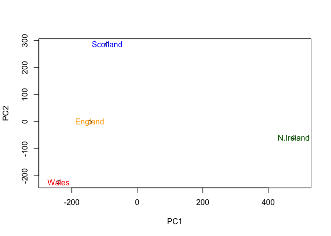
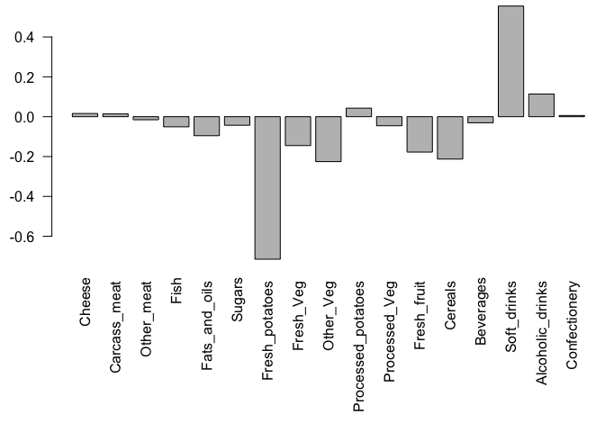

# Class 07: Machine Learning
Lena (A16420052)

# Clustering

We will start today’s lab with clustering methods, in particular
so-called K-means. The main function for this in R is `kmeans()`

``` r
x <- rnorm(10000, mean=3)
hist(x)
```



60 points

``` r
tmp <-c(rnorm(30, mean=3), rnorm(30, -3))
#numbers change each time code runs
tmp
```

     [1]  3.2079402  3.8379545  2.7153373  3.1563146  3.0596436  4.2649042
     [7]  2.2986235  4.8165629  0.6598799  4.0725064  1.7719990  2.9766991
    [13]  3.3944741  3.2054378  3.3489817  2.3405344  2.6828452  4.1146167
    [19]  1.6850191  4.2292177  2.2550331  1.5144283  3.0082861  3.3235530
    [25]  3.8083605  3.1579254  1.3812071  2.7887818  2.9220688  4.5679539
    [31] -3.6791684 -3.1710889 -3.3297816 -2.9405330 -1.5216839 -3.6104105
    [37] -4.2631650 -0.7881168 -4.7914092 -2.8414049 -3.6009848 -2.5497962
    [43] -3.1028053 -3.5086257 -1.3078802 -4.2657581 -3.0601930 -2.8427023
    [49] -4.1057986 -3.8705394 -2.6449298 -3.4189231 -4.4564080 -2.2106188
    [55] -3.0885516 -3.6435962 -2.9235112 -2.5869917 -4.4273110 -3.5065205

``` r
#flips order of the code
x <- cbind(x=tmp, y=rev(tmp))
head(x)
```

                x         y
    [1,] 3.207940 -3.506520
    [2,] 3.837955 -4.427311
    [3,] 2.715337 -2.586992
    [4,] 3.156315 -2.923511
    [5,] 3.059644 -3.643596
    [6,] 4.264904 -3.088552

We can pass this to the base R `plot()` function for a quick simple plot

``` r
plot(x)
```



``` r
k <- kmeans(x, centers= 2, nstart=20)
k
```

    K-means clustering with 2 clusters of sizes 30, 30

    Cluster means:
              x         y
    1 -3.201974  3.018903
    2  3.018903 -3.201974

    Clustering vector:
     [1] 2 2 2 2 2 2 2 2 2 2 2 2 2 2 2 2 2 2 2 2 2 2 2 2 2 2 2 2 2 2 1 1 1 1 1 1 1 1
    [39] 1 1 1 1 1 1 1 1 1 1 1 1 1 1 1 1 1 1 1 1 1 1

    Within cluster sum of squares by cluster:
    [1] 53.28778 53.28778
     (between_SS / total_SS =  91.6 %)

    Available components:

    [1] "cluster"      "centers"      "totss"        "withinss"     "tot.withinss"
    [6] "betweenss"    "size"         "iter"         "ifault"      

> Q1. How many points are in each cluster?

``` r
k$size
```

    [1] 30 30

> Q2. Cluster membership?

``` r
k$cluster
```

     [1] 2 2 2 2 2 2 2 2 2 2 2 2 2 2 2 2 2 2 2 2 2 2 2 2 2 2 2 2 2 2 1 1 1 1 1 1 1 1
    [39] 1 1 1 1 1 1 1 1 1 1 1 1 1 1 1 1 1 1 1 1 1 1

> Q3. Cluster centers?

``` r
k$centers
```

              x         y
    1 -3.201974  3.018903
    2  3.018903 -3.201974

> Q4. Plot my clustering results (with base R)

``` r
plot(x, col=k$cluster, pch=16)
```


> Q5. Cluster the data again with kmeans() into 4 groups and plot the
> results

``` r
k4 <- kmeans(x, centers=4, nstart=20)
plot(x, col=k4$cluster, pch=16)
```



K-means is very popular mostly because it is fast and relatively
straightforward to run and understand. It has a big limitation in that
you need to tell it how many groups (k, or centers) you want.

\#Hierarchical clustering

The main function in base R is called `hclust()`. You have to pass it in
a “distance matrix” not just your input data

You can generate a distance matrix with the `dist()` function

``` r
hc <- hclust(dist(x))
hc
```


    Call:
    hclust(d = dist(x))

    Cluster method   : complete 
    Distance         : euclidean 
    Number of objects: 60 

``` r
plot(hc)
```



To find clusters (cluster membership vectors) from a `hclust` result we
can “cut” the tree at a ceratin height that we like

``` r
plot(hc)
abline(h=8, col="red")
```



``` r
grps <- cutree(hc, h=8)
```

``` r
table(grps)
```

    grps
     1  2 
    30 30 

> Q6. Plot our hclust results

``` r
plot(x, col=grps, pch=16 )
```



\#Principle Component Analysis

## PCA of UK food data

Read data showing the consumption in grams (per person, per week) of 17
different types of food-stuff measured and averaged in the four
countries of the United Kingdom

``` r
url <- "https://tinyurl.com/UK-foods"
x <- read.csv(url)
x
```

                         X England Wales Scotland N.Ireland
    1               Cheese     105   103      103        66
    2        Carcass_meat      245   227      242       267
    3          Other_meat      685   803      750       586
    4                 Fish     147   160      122        93
    5       Fats_and_oils      193   235      184       209
    6               Sugars     156   175      147       139
    7      Fresh_potatoes      720   874      566      1033
    8           Fresh_Veg      253   265      171       143
    9           Other_Veg      488   570      418       355
    10 Processed_potatoes      198   203      220       187
    11      Processed_Veg      360   365      337       334
    12        Fresh_fruit     1102  1137      957       674
    13            Cereals     1472  1582     1462      1494
    14           Beverages      57    73       53        47
    15        Soft_drinks     1374  1256     1572      1506
    16   Alcoholic_drinks      375   475      458       135
    17      Confectionery       54    64       62        41

> Q1. How many rows and columns are in your new data frame named x? What
> R functions could you use to answer this questions?

``` r
dim(x)
```

    [1] 17  5

``` r
# Note how the minus indexing works
rownames(x) <- x[,1]
x <- x[,-1]
head(x)
```

                   England Wales Scotland N.Ireland
    Cheese             105   103      103        66
    Carcass_meat       245   227      242       267
    Other_meat         685   803      750       586
    Fish               147   160      122        93
    Fats_and_oils      193   235      184       209
    Sugars             156   175      147       139

``` r
#this removes the first column
```

``` r
url <- "https://tinyurl.com/UK-foods"
x <- read.csv(url, row.names=1)
x
```

                        England Wales Scotland N.Ireland
    Cheese                  105   103      103        66
    Carcass_meat            245   227      242       267
    Other_meat              685   803      750       586
    Fish                    147   160      122        93
    Fats_and_oils           193   235      184       209
    Sugars                  156   175      147       139
    Fresh_potatoes          720   874      566      1033
    Fresh_Veg               253   265      171       143
    Other_Veg               488   570      418       355
    Processed_potatoes      198   203      220       187
    Processed_Veg           360   365      337       334
    Fresh_fruit            1102  1137      957       674
    Cereals                1472  1582     1462      1494
    Beverages                57    73       53        47
    Soft_drinks            1374  1256     1572      1506
    Alcoholic_drinks        375   475      458       135
    Confectionery            54    64       62        41

> Q2. Which approach to solving the ‘row-names problem’ mentioned above
> do you prefer and why? Is one approach more robust than another under
> certain circumstances?

I prefer the second approach using row.names. It is more simplied and
does not affect the code as you run it multiple times.

> Q3: Changing what optional argument in the above barplot() function
> results in the following plot?

By changing the beside argument to False results in the following plot:

``` r
barplot(as.matrix(x), beside=F, col=rainbow(nrow(x)))
```


If beside argument is FALSE, the columns of height are portrayed as
stacked bars. If it is TRUE, the columns are portrayed as juxtaposed
bars.

> Q5: Generating all pairwise plots may help somewhat. Can you make
> sense of the following code and resulting figure? What does it mean if
> a given point lies on the diagonal for a given plot?

``` r
pairs(x, col=rainbow(10), pch=16)
```


A given point that lies on the diagonal for a given plot indicates that
consumption of a particular food matches between countries.

\##Principal Component Analysis (PCA)

PCA can help us make sense of these types of datasets. Let’s see how it
works.

The main function in “base” R is called `prcomp()`. In this case we want
to first take the transpose `t()` of our input `x` so the columns are
the food types and the countries are the rows

``` r
head(t(x))
```

              Cheese Carcass_meat  Other_meat  Fish Fats_and_oils  Sugars
    England      105           245         685  147            193    156
    Wales        103           227         803  160            235    175
    Scotland     103           242         750  122            184    147
    N.Ireland     66           267         586   93            209    139
              Fresh_potatoes  Fresh_Veg  Other_Veg  Processed_potatoes 
    England               720        253        488                 198
    Wales                 874        265        570                 203
    Scotland              566        171        418                 220
    N.Ireland            1033        143        355                 187
              Processed_Veg  Fresh_fruit  Cereals  Beverages Soft_drinks 
    England              360         1102     1472        57         1374
    Wales                365         1137     1582        73         1256
    Scotland             337          957     1462        53         1572
    N.Ireland            334          674     1494        47         1506
              Alcoholic_drinks  Confectionery 
    England                 375             54
    Wales                   475             64
    Scotland                458             62
    N.Ireland               135             41

``` r
pca <- prcomp(t(x))
summary(pca)
```

    Importance of components:
                                PC1      PC2      PC3       PC4
    Standard deviation     324.1502 212.7478 73.87622 3.176e-14
    Proportion of Variance   0.6744   0.2905  0.03503 0.000e+00
    Cumulative Proportion    0.6744   0.9650  1.00000 1.000e+00

> Q6. What is the main differences between N. Ireland and the other
> countries of the UK in terms of this data-set?

The plots show more off diagonal points when N. Ireland is compared to
other countires of the UK

``` r
pca$x
```

                     PC1         PC2        PC3           PC4
    England   -144.99315   -2.532999 105.768945 -4.894696e-14
    Wales     -240.52915 -224.646925 -56.475555  5.700024e-13
    Scotland   -91.86934  286.081786 -44.415495 -7.460785e-13
    N.Ireland  477.39164  -58.901862  -4.877895  2.321303e-13

> Q7. Complete the code below to generate a plot of PC1 vs PC2. The
> second line adds text labels over the data points.

``` r
# Plot PC1 vs PC2
plot(pca$x[ ,1], pca$x[ , 2], xlab="PC1", ylab="PC2", xlim=c(-270,500))
text(pca$x[,1], pca$x[,2], colnames(x))
```


> Q8. Customize your plot so that the colors of the country names match
> the colors in our UK and Ireland map and table at start of this
> document.

``` r
plot(pca$x[ ,1], pca$x[ , 2], xlab="PC1", ylab="PC2", xlim=c(-270,500))
text(pca$x[, 1], pca$x[, 2], col=c("orange", "red", "blue", "darkgreen"), colnames(x))
```



The “loadings” tell us how much the original variables (in our case the
foods) contribute to the new variables i.e. the PCs

``` r
head(pca$rotation)
```

                            PC1         PC2         PC3          PC4
    Cheese         -0.056955380  0.01601285  0.02394295 -0.694538519
    Carcass_meat    0.047927628  0.01391582  0.06367111  0.489884628
    Other_meat     -0.258916658 -0.01533114 -0.55384854  0.279023718
    Fish           -0.084414983 -0.05075495  0.03906481 -0.008483145
    Fats_and_oils  -0.005193623 -0.09538866 -0.12522257  0.076097502
    Sugars         -0.037620983 -0.04302170 -0.03605745  0.034101334

> Q9: Generate a similar ‘loadings plot’ for PC2. What two food groups
> feature prominantely and what does PC2 maninly tell us about?

PC2 tells us fresh potatoes and soft drinks feature prominently. PC2
mainly tells us the second most variance in the data set and that
potatoes and soft drinks varied the second most between the countries.

``` r
v <- round( pca$sdev^2/sum(pca$sdev^2) * 100 )
v
```

    [1] 67 29  4  0

``` r
## or the second row here...
z <- summary(pca)
z$importance
```

                                 PC1       PC2      PC3          PC4
    Standard deviation     324.15019 212.74780 73.87622 3.175833e-14
    Proportion of Variance   0.67444   0.29052  0.03503 0.000000e+00
    Cumulative Proportion    0.67444   0.96497  1.00000 1.000000e+00

``` r
barplot(v, xlab="Principal Component", ylab="Percent Variation")
```


``` r
## Lets focus on PC1 as it accounts for > 90% of variance 
par(mar=c(10, 3, 0.35, 0))
barplot( pca$rotation[,1], las=2 )
```


``` r
#PC2
par(mar=c(10, 3, 0.35, 0))
barplot( pca$rotation[,2], las=2 )
```


