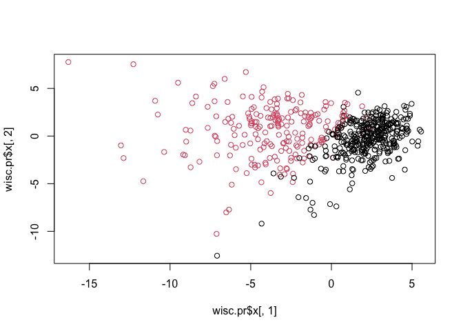
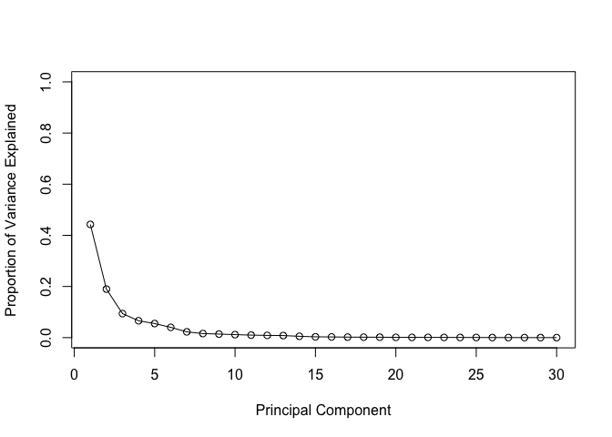

# Class 08: Mini Project
Lena (A16420052)

## Outline

Today we will apply the machine learning methods we introduced in the
last class on breast cancer biopsy data from fine needle aspiration
(FNA)

## Data input

The data is supplied in CSV format

``` r
wisc.df <- read.csv("WisconsinCancer.csv", row.names=1)
head(wisc.df)
```

             diagnosis radius_mean texture_mean perimeter_mean area_mean
    842302           M       17.99        10.38         122.80    1001.0
    842517           M       20.57        17.77         132.90    1326.0
    84300903         M       19.69        21.25         130.00    1203.0
    84348301         M       11.42        20.38          77.58     386.1
    84358402         M       20.29        14.34         135.10    1297.0
    843786           M       12.45        15.70          82.57     477.1
             smoothness_mean compactness_mean concavity_mean concave.points_mean
    842302           0.11840          0.27760         0.3001             0.14710
    842517           0.08474          0.07864         0.0869             0.07017
    84300903         0.10960          0.15990         0.1974             0.12790
    84348301         0.14250          0.28390         0.2414             0.10520
    84358402         0.10030          0.13280         0.1980             0.10430
    843786           0.12780          0.17000         0.1578             0.08089
             symmetry_mean fractal_dimension_mean radius_se texture_se perimeter_se
    842302          0.2419                0.07871    1.0950     0.9053        8.589
    842517          0.1812                0.05667    0.5435     0.7339        3.398
    84300903        0.2069                0.05999    0.7456     0.7869        4.585
    84348301        0.2597                0.09744    0.4956     1.1560        3.445
    84358402        0.1809                0.05883    0.7572     0.7813        5.438
    843786          0.2087                0.07613    0.3345     0.8902        2.217
             area_se smoothness_se compactness_se concavity_se concave.points_se
    842302    153.40      0.006399        0.04904      0.05373           0.01587
    842517     74.08      0.005225        0.01308      0.01860           0.01340
    84300903   94.03      0.006150        0.04006      0.03832           0.02058
    84348301   27.23      0.009110        0.07458      0.05661           0.01867
    84358402   94.44      0.011490        0.02461      0.05688           0.01885
    843786     27.19      0.007510        0.03345      0.03672           0.01137
             symmetry_se fractal_dimension_se radius_worst texture_worst
    842302       0.03003             0.006193        25.38         17.33
    842517       0.01389             0.003532        24.99         23.41
    84300903     0.02250             0.004571        23.57         25.53
    84348301     0.05963             0.009208        14.91         26.50
    84358402     0.01756             0.005115        22.54         16.67
    843786       0.02165             0.005082        15.47         23.75
             perimeter_worst area_worst smoothness_worst compactness_worst
    842302            184.60     2019.0           0.1622            0.6656
    842517            158.80     1956.0           0.1238            0.1866
    84300903          152.50     1709.0           0.1444            0.4245
    84348301           98.87      567.7           0.2098            0.8663
    84358402          152.20     1575.0           0.1374            0.2050
    843786            103.40      741.6           0.1791            0.5249
             concavity_worst concave.points_worst symmetry_worst
    842302            0.7119               0.2654         0.4601
    842517            0.2416               0.1860         0.2750
    84300903          0.4504               0.2430         0.3613
    84348301          0.6869               0.2575         0.6638
    84358402          0.4000               0.1625         0.2364
    843786            0.5355               0.1741         0.3985
             fractal_dimension_worst
    842302                   0.11890
    842517                   0.08902
    84300903                 0.08758
    84348301                 0.17300
    84358402                 0.07678
    843786                   0.12440

``` r
# We can use -1 here to remove the first column
wisc.data <- wisc.df[,-1]
```

``` r
#set diagnosis as a factor 
diagnosis <- as.factor(wisc.df$diagnosis)
head(diagnosis)
```

    [1] M M M M M M
    Levels: B M

> Q1. How many observations are in the dataset?

``` r
nrow(wisc.data)
```

    [1] 569

``` r
#dim(wisc.data) also works!
```

There are 569 observations in the dataset

> Q2. How many of the observations have a malignant diagnosis?

``` r
sum(diagnosis== "M")
```

    [1] 212

``` r
#table()
table(wisc.df$diagnosis)
```


      B   M 
    357 212 

There are 212 observations with a malignant diagnosis.

> Q3. How many variables/features in the data are suffixed with \_mean?

``` r
#colnames(wisc.data)
#grep searches first argument inside of second factor 
length(grep("_mean", colnames(wisc.data)))
```

    [1] 10

There are 10 variables/features with the suffix \_mean.

## Principle Component Analysis

We need to scale our input data before PCA as some of the columns are
measures in terms of very different units with different means and
different variances. The upshot here is we set `scale=TRUE` argument to
`prcomp()`

``` r
# Check column means and standard deviations
colMeans(wisc.data)
```

                radius_mean            texture_mean          perimeter_mean 
               1.412729e+01            1.928965e+01            9.196903e+01 
                  area_mean         smoothness_mean        compactness_mean 
               6.548891e+02            9.636028e-02            1.043410e-01 
             concavity_mean     concave.points_mean           symmetry_mean 
               8.879932e-02            4.891915e-02            1.811619e-01 
     fractal_dimension_mean               radius_se              texture_se 
               6.279761e-02            4.051721e-01            1.216853e+00 
               perimeter_se                 area_se           smoothness_se 
               2.866059e+00            4.033708e+01            7.040979e-03 
             compactness_se            concavity_se       concave.points_se 
               2.547814e-02            3.189372e-02            1.179614e-02 
                symmetry_se    fractal_dimension_se            radius_worst 
               2.054230e-02            3.794904e-03            1.626919e+01 
              texture_worst         perimeter_worst              area_worst 
               2.567722e+01            1.072612e+02            8.805831e+02 
           smoothness_worst       compactness_worst         concavity_worst 
               1.323686e-01            2.542650e-01            2.721885e-01 
       concave.points_worst          symmetry_worst fractal_dimension_worst 
               1.146062e-01            2.900756e-01            8.394582e-02 

``` r
apply(wisc.data,2,sd)
```

                radius_mean            texture_mean          perimeter_mean 
               3.524049e+00            4.301036e+00            2.429898e+01 
                  area_mean         smoothness_mean        compactness_mean 
               3.519141e+02            1.406413e-02            5.281276e-02 
             concavity_mean     concave.points_mean           symmetry_mean 
               7.971981e-02            3.880284e-02            2.741428e-02 
     fractal_dimension_mean               radius_se              texture_se 
               7.060363e-03            2.773127e-01            5.516484e-01 
               perimeter_se                 area_se           smoothness_se 
               2.021855e+00            4.549101e+01            3.002518e-03 
             compactness_se            concavity_se       concave.points_se 
               1.790818e-02            3.018606e-02            6.170285e-03 
                symmetry_se    fractal_dimension_se            radius_worst 
               8.266372e-03            2.646071e-03            4.833242e+00 
              texture_worst         perimeter_worst              area_worst 
               6.146258e+00            3.360254e+01            5.693570e+02 
           smoothness_worst       compactness_worst         concavity_worst 
               2.283243e-02            1.573365e-01            2.086243e-01 
       concave.points_worst          symmetry_worst fractal_dimension_worst 
               6.573234e-02            6.186747e-02            1.806127e-02 

``` r
# Perform PCA on wisc.data by completing the following code
wisc.pr <- prcomp(wisc.data, scale=TRUE)
```

``` r
# Look at summary of results
summary(wisc.pr)
```

    Importance of components:
                              PC1    PC2     PC3     PC4     PC5     PC6     PC7
    Standard deviation     3.6444 2.3857 1.67867 1.40735 1.28403 1.09880 0.82172
    Proportion of Variance 0.4427 0.1897 0.09393 0.06602 0.05496 0.04025 0.02251
    Cumulative Proportion  0.4427 0.6324 0.72636 0.79239 0.84734 0.88759 0.91010
                               PC8    PC9    PC10   PC11    PC12    PC13    PC14
    Standard deviation     0.69037 0.6457 0.59219 0.5421 0.51104 0.49128 0.39624
    Proportion of Variance 0.01589 0.0139 0.01169 0.0098 0.00871 0.00805 0.00523
    Cumulative Proportion  0.92598 0.9399 0.95157 0.9614 0.97007 0.97812 0.98335
                              PC15    PC16    PC17    PC18    PC19    PC20   PC21
    Standard deviation     0.30681 0.28260 0.24372 0.22939 0.22244 0.17652 0.1731
    Proportion of Variance 0.00314 0.00266 0.00198 0.00175 0.00165 0.00104 0.0010
    Cumulative Proportion  0.98649 0.98915 0.99113 0.99288 0.99453 0.99557 0.9966
                              PC22    PC23   PC24    PC25    PC26    PC27    PC28
    Standard deviation     0.16565 0.15602 0.1344 0.12442 0.09043 0.08307 0.03987
    Proportion of Variance 0.00091 0.00081 0.0006 0.00052 0.00027 0.00023 0.00005
    Cumulative Proportion  0.99749 0.99830 0.9989 0.99942 0.99969 0.99992 0.99997
                              PC29    PC30
    Standard deviation     0.02736 0.01153
    Proportion of Variance 0.00002 0.00000
    Cumulative Proportion  1.00000 1.00000

Generate one of our main results figures- the PC plot (a.k.a “score
plot”, “orientation plot”, “PC1 vs PC2 plot”, “PC plot”, “projection
plot”, etc.) It is known by different names in different fields.

``` r
#can use xlab, ylab arguments to name axis in plot()
plot(wisc.pr$x[, 1], wisc.pr$x[, 2],col=diagnosis)
```



> Q4. From your results, what proportion of the original variance is
> captured by the first principal components (PC1)?

``` r
wisc.pr$sdev[1]^2/sum(wisc.pr$sdev^2)
```

    [1] 0.4427203

``` r
#wisc.pr$sdev[1] gives you the stdev for PC1 ([1])
#sum(wisc.pr$sdev^2) gives you total for the proportion
```

> Q5. How many principal components (PCs) are required to describe at
> least 70% of the original variance in the data?

``` r
#cumsum() cumulative sum
var_PCs <- cumsum(wisc.pr$sdev^2/sum(wisc.pr$sdev^2))
which(var_PCs >= 0.7)[1]
```

    [1] 3

``` r
var_PCs[3]
```

    [1] 0.7263637

> Q6. How many principal components (PCs) are required to describe at
> least 90% of the original variance in the data?

``` r
var_PCs <- cumsum(wisc.pr$sdev^2/sum(wisc.pr$sdev^2))
which(var_PCs >= 0.9)[1]
```

    [1] 7

``` r
var_PCs[7]
```

    [1] 0.9100953

## Interpreting PCA results

``` r
biplot(wisc.pr)
```


> Q7. What stands out to you about this plot? Is it easy or difficult to
> understand? Why?

This plot is very difficult to interpret and understand because the
points are overlapping.

``` r
# Scatter plot observations by components 1 and 2
plot(wisc.pr$x[,1], wisc.pr$x[, 2], col = diagnosis , 
     xlab = "PC1", ylab = "PC2")
```


> Q8. Generate a similar plot for principal components 1 and 3. What do
> you notice about these plots?

``` r
plot(wisc.pr$x[,1], wisc.pr$x[, 3], col = diagnosis , 
     xlab = "PC1", ylab = "PC3")
```


Each point represents observations variance for PC1 VS PC3 instead of a
point for each observation for every PC.

Using ggplot2 to visualize data

``` r
# Create a data.frame for ggplot
df <- as.data.frame(wisc.pr$x)
df$diagnosis <- diagnosis

# Load the ggplot2 package
library(ggplot2)

# Make a scatter plot colored by diagnosis
ggplot(df, aes(PC1, PC2, col=diagnosis)) + 
  geom_point()
```


## Variance Explained

``` r
# Calculate variance of each component
pr.var <- wisc.pr$sdev^2
head(pr.var)
```

    [1] 13.281608  5.691355  2.817949  1.980640  1.648731  1.207357

``` r
# Variance explained by each principal component: pve
pve <- pr.var/ sum(pr.var)

# Plot variance explained for each principal component
plot(pve, xlab = "Principal Component", 
     ylab = "Proportion of Variance Explained", 
     ylim = c(0, 1), type = "o")
```



## Communicating PCA results

> Q9. For the first principal component, what is the component of the
> loading vector (i.e. wisc.pr\$rotation\[,1\]) for the feature
> concave.points_mean?

``` r
load_vec <- wisc.pr$rotation[,1]
load_vec["concave.points_mean"]
```

    concave.points_mean 
             -0.2608538 

> Q10. What is the minimum number of principal components required to
> explain 80% of the variance of the data?

``` r
pr.var_PC <- cumsum(pve)
which(pr.var_PC >= 0.8)[1]
```

    [1] 5

``` r
pr.var_PC[5]
```

    [1] 0.8473427

## Hierarchical clustering

``` r
data.scale <- scale(wisc.data)
data.dist <- dist(data.scale)
wisc.hclust <- hclust(data.dist, method= "complete")
wisc.hclust
```


    Call:
    hclust(d = data.dist, method = "complete")

    Cluster method   : complete 
    Distance         : euclidean 
    Number of objects: 569 

> Q11. Using the plot() and abline() functions, what is the height at
> which the clustering model has 4 clusters?

``` r
plot(wisc.hclust)
abline(h=19, col="red", lty=2)
```


From analyzing the dendrogram, h=19 is where the clustering model has 4
clusters.

## Selecting number of clusters

Generate 2 cluster groups from this hclust object.

``` r
wisc.hclust.clusters <- cutree(wisc.hclust, k=2)
#if you do h do 18
table(wisc.hclust.clusters, diagnosis)
```

                        diagnosis
    wisc.hclust.clusters   B   M
                       1 357 210
                       2   0   2

> Q12. Can you find a better cluster vs diagnoses match by cutting into
> a different number of clusters between 2 and 10?

No I cannot find a better cluster vs diagnoses match than k=4. All other
number of clusters result in low separation for cluster vs diagnosis
match.

> Q13. Which method gives your favorite results for the same data.dist
> dataset? Explain your reasoning.

Method= ward.D2 because it separates clusters sooner at a lower height.

``` r
single <- hclust(data.dist, method="single")
average <- hclust(data.dist, method="average")
ward.D2 <- hclust(data.dist, method="ward.D2")

plot(single)
```


``` r
plot(average)
```


``` r
plot(ward.D2)
```


## Combining methods

``` r
#it is [7] because that is what we solved in Q6
d <- dist(wisc.pr$x[, 1:7])
wisc.hclust.pr <- hclust(d, method= "ward.D2")
grps <- cutree(wisc.hclust.pr, k=2)
table(grps)
```

    grps
      1   2 
    216 353 

``` r
table(grps, diagnosis)
```

        diagnosis
    grps   B   M
       1  28 188
       2 329  24

``` r
plot(wisc.pr$x[,1:2], col=grps)
```


``` r
#col=diagnosis
plot(wisc.pr$x[,1:2], col=diagnosis)
```


> Q15. How well does the newly created model with four clusters separate
> out the two diagnoses?

The newly created model with four clusters separates better.

``` r
# Compare to actual diagnoses
wisc.pr.hclust <- hclust(dist(wisc.pr$x[, 1:7]), method="ward.D2")
wisc.pr.hclust.clusters <- cutree(wisc.pr.hclust, k=2)
table(wisc.pr.hclust.clusters, diagnosis)
```

                           diagnosis
    wisc.pr.hclust.clusters   B   M
                          1  28 188
                          2 329  24

``` r
plot(wisc.pr$x[,1:7], col=diagnosis)
```


``` r
#wisc.pr$x is pulling PCs
```
