# Class 10: Comparative analysis of structure & Class 11: Alpha Fold
Lena (A16420052)

## Comparative structure analysis of Adenylate Kinase

We need some packages for today’s class. These include `bio3d` and `msa`

The `msa` package is from Bioconductor. These packages focus on genomics
type work and are managed by the `BiocManager` package.

Install `install.packages("BiocManager")` and then
`BiocManager::install("msa")`

``` r
library(bio3d)

aa <- get.seq("1ake_A")
```

    Warning in get.seq("1ake_A"): Removing existing file: seqs.fasta

    Fetching... Please wait. Done.

``` r
aa
```

                 1        .         .         .         .         .         60 
    pdb|1AKE|A   MRIILLGAPGAGKGTQAQFIMEKYGIPQISTGDMLRAAVKSGSELGKQAKDIMDAGKLVT
                 1        .         .         .         .         .         60 

                61        .         .         .         .         .         120 
    pdb|1AKE|A   DELVIALVKERIAQEDCRNGFLLDGFPRTIPQADAMKEAGINVDYVLEFDVPDELIVDRI
                61        .         .         .         .         .         120 

               121        .         .         .         .         .         180 
    pdb|1AKE|A   VGRRVHAPSGRVYHVKFNPPKVEGKDDVTGEELTTRKDDQEETVRKRLVEYHQMTAPLIG
               121        .         .         .         .         .         180 

               181        .         .         .   214 
    pdb|1AKE|A   YYSKEAEAGNTKYAKVDGTKPVAEVRADLEKILG
               181        .         .         .   214 

    Call:
      read.fasta(file = outfile)

    Class:
      fasta

    Alignment dimensions:
      1 sequence rows; 214 position columns (214 non-gap, 0 gap) 

    + attr: id, ali, call

Now I can search the PDB database for related seuqences:

``` r
# Blast or hmmer search 
#b <- blast.pdb(aa)
```

``` r
#hits <-  plot(b)
```

``` r
#attributes(b)
# List out some 'top hits'
#head(b$hit.tbl)
```

These are the related structures in the PDB database that we found via a
BLAST search…

``` r
hits <- NULL
hits$pdb.id <- c('1AKE_A','6S36_A','6RZE_A','3HPR_A','1E4V_A','5EJE_A','1E4Y_A','3X2S_A','6HAP_A','6HAM_A','4K46_A','3GMT_A','4PZL_A')
```

Side-note: Lets annotate these structures (in other words find out what
they are, what species they are from, stuff about the experiment they
were solved in etc.)

For this we can use the `pdb.annotate()`

``` r
anno <- pdb.annotate(hits$pdb.id)
head(anno)
```

           structureId chainId macromoleculeType chainLength experimentalTechnique
    1AKE_A        1AKE       A           Protein         214                 X-ray
    6S36_A        6S36       A           Protein         214                 X-ray
    6RZE_A        6RZE       A           Protein         214                 X-ray
    3HPR_A        3HPR       A           Protein         214                 X-ray
    1E4V_A        1E4V       A           Protein         214                 X-ray
    5EJE_A        5EJE       A           Protein         214                 X-ray
           resolution       scopDomain                                        pfam
    1AKE_A       2.00 Adenylate kinase                      Adenylate kinase (ADK)
    6S36_A       1.60             <NA>                      Adenylate kinase (ADK)
    6RZE_A       1.69             <NA> Adenylate kinase, active site lid (ADK_lid)
    3HPR_A       2.00             <NA> Adenylate kinase, active site lid (ADK_lid)
    1E4V_A       1.85 Adenylate kinase                      Adenylate kinase (ADK)
    5EJE_A       1.90             <NA>                      Adenylate kinase (ADK)
                   ligandId                                       ligandName
    1AKE_A              AP5                 BIS(ADENOSINE)-5'-PENTAPHOSPHATE
    6S36_A CL (3),NA,MG (2)    CHLORIDE ION (3),SODIUM ION,MAGNESIUM ION (2)
    6RZE_A    NA (3),CL (2)                  SODIUM ION (3),CHLORIDE ION (2)
    3HPR_A              AP5                 BIS(ADENOSINE)-5'-PENTAPHOSPHATE
    1E4V_A              AP5                 BIS(ADENOSINE)-5'-PENTAPHOSPHATE
    5EJE_A           AP5,CO BIS(ADENOSINE)-5'-PENTAPHOSPHATE,COBALT (II) ION
                                           source
    1AKE_A                       Escherichia coli
    6S36_A                       Escherichia coli
    6RZE_A                       Escherichia coli
    3HPR_A                  Escherichia coli K-12
    1E4V_A                       Escherichia coli
    5EJE_A Escherichia coli O139:H28 str. E24377A
                                                                                                                                                                         structureTitle
    1AKE_A STRUCTURE OF THE COMPLEX BETWEEN ADENYLATE KINASE FROM ESCHERICHIA COLI AND THE INHIBITOR AP5A REFINED AT 1.9 ANGSTROMS RESOLUTION: A MODEL FOR A CATALYTIC TRANSITION STATE
    6S36_A                                                                                                                   Crystal structure of E. coli Adenylate kinase R119K mutant
    6RZE_A                                                                                                                   Crystal structure of E. coli Adenylate kinase R119A mutant
    3HPR_A                                                                                               Crystal structure of V148G adenylate kinase from E. coli, in complex with Ap5A
    1E4V_A                                                                                                       Mutant G10V of adenylate kinase from E. coli, modified in the Gly-loop
    5EJE_A                                                                                  Crystal structure of E. coli Adenylate kinase G56C/T163C double mutant in complex with Ap5a
                                                        citation rObserved  rFree
    1AKE_A                Muller, C.W., et al. J Mol Biol (1992)    0.1960     NA
    6S36_A                 Rogne, P., et al. Biochemistry (2019)    0.1632 0.2356
    6RZE_A                 Rogne, P., et al. Biochemistry (2019)    0.1865 0.2350
    3HPR_A Schrank, T.P., et al. Proc Natl Acad Sci U S A (2009)    0.2100 0.2432
    1E4V_A                  Muller, C.W., et al. Proteins (1993)    0.1960     NA
    5EJE_A Kovermann, M., et al. Proc Natl Acad Sci U S A (2017)    0.1889 0.2358
            rWork spaceGroup
    1AKE_A 0.1960  P 21 2 21
    6S36_A 0.1594    C 1 2 1
    6RZE_A 0.1819    C 1 2 1
    3HPR_A 0.2062  P 21 21 2
    1E4V_A 0.1960  P 21 2 21
    5EJE_A 0.1863  P 21 2 21

Now we can download all these structures for further analysis with the
`get.pdb()` function.

``` r
# Download releated PDB files
#gzips file size smaller, path creates folder of current directory 
files <- get.pdb(hits$pdb.id, path="pdbs", split=TRUE, gzip=TRUE)
```

    Warning in get.pdb(hits$pdb.id, path = "pdbs", split = TRUE, gzip = TRUE):
    pdbs/1AKE.pdb.gz exists. Skipping download

    Warning in get.pdb(hits$pdb.id, path = "pdbs", split = TRUE, gzip = TRUE):
    pdbs/6S36.pdb.gz exists. Skipping download

    Warning in get.pdb(hits$pdb.id, path = "pdbs", split = TRUE, gzip = TRUE):
    pdbs/6RZE.pdb.gz exists. Skipping download

    Warning in get.pdb(hits$pdb.id, path = "pdbs", split = TRUE, gzip = TRUE):
    pdbs/3HPR.pdb.gz exists. Skipping download

    Warning in get.pdb(hits$pdb.id, path = "pdbs", split = TRUE, gzip = TRUE):
    pdbs/1E4V.pdb.gz exists. Skipping download

    Warning in get.pdb(hits$pdb.id, path = "pdbs", split = TRUE, gzip = TRUE):
    pdbs/5EJE.pdb.gz exists. Skipping download

    Warning in get.pdb(hits$pdb.id, path = "pdbs", split = TRUE, gzip = TRUE):
    pdbs/1E4Y.pdb.gz exists. Skipping download

    Warning in get.pdb(hits$pdb.id, path = "pdbs", split = TRUE, gzip = TRUE):
    pdbs/3X2S.pdb.gz exists. Skipping download

    Warning in get.pdb(hits$pdb.id, path = "pdbs", split = TRUE, gzip = TRUE):
    pdbs/6HAP.pdb.gz exists. Skipping download

    Warning in get.pdb(hits$pdb.id, path = "pdbs", split = TRUE, gzip = TRUE):
    pdbs/6HAM.pdb.gz exists. Skipping download

    Warning in get.pdb(hits$pdb.id, path = "pdbs", split = TRUE, gzip = TRUE):
    pdbs/4K46.pdb.gz exists. Skipping download

    Warning in get.pdb(hits$pdb.id, path = "pdbs", split = TRUE, gzip = TRUE):
    pdbs/3GMT.pdb.gz exists. Skipping download

    Warning in get.pdb(hits$pdb.id, path = "pdbs", split = TRUE, gzip = TRUE):
    pdbs/4PZL.pdb.gz exists. Skipping download


      |                                                                            
      |                                                                      |   0%
      |                                                                            
      |=====                                                                 |   8%
      |                                                                            
      |===========                                                           |  15%
      |                                                                            
      |================                                                      |  23%
      |                                                                            
      |======================                                                |  31%
      |                                                                            
      |===========================                                           |  38%
      |                                                                            
      |================================                                      |  46%
      |                                                                            
      |======================================                                |  54%
      |                                                                            
      |===========================================                           |  62%
      |                                                                            
      |================================================                      |  69%
      |                                                                            
      |======================================================                |  77%
      |                                                                            
      |===========================================================           |  85%
      |                                                                            
      |=================================================================     |  92%
      |                                                                            
      |======================================================================| 100%

Now we have all of these related structures we can Align and Superpose…

``` r
# Align releated PDBs
pdbs <- pdbaln(files, fit = TRUE, exefile="msa")
```

    Reading PDB files:
    pdbs/split_chain/1AKE_A.pdb
    pdbs/split_chain/6S36_A.pdb
    pdbs/split_chain/6RZE_A.pdb
    pdbs/split_chain/3HPR_A.pdb
    pdbs/split_chain/1E4V_A.pdb
    pdbs/split_chain/5EJE_A.pdb
    pdbs/split_chain/1E4Y_A.pdb
    pdbs/split_chain/3X2S_A.pdb
    pdbs/split_chain/6HAP_A.pdb
    pdbs/split_chain/6HAM_A.pdb
    pdbs/split_chain/4K46_A.pdb
    pdbs/split_chain/3GMT_A.pdb
    pdbs/split_chain/4PZL_A.pdb
       PDB has ALT records, taking A only, rm.alt=TRUE
    .   PDB has ALT records, taking A only, rm.alt=TRUE
    .   PDB has ALT records, taking A only, rm.alt=TRUE
    .   PDB has ALT records, taking A only, rm.alt=TRUE
    ..   PDB has ALT records, taking A only, rm.alt=TRUE
    ....   PDB has ALT records, taking A only, rm.alt=TRUE
    .   PDB has ALT records, taking A only, rm.alt=TRUE
    ...

    Extracting sequences

    pdb/seq: 1   name: pdbs/split_chain/1AKE_A.pdb 
       PDB has ALT records, taking A only, rm.alt=TRUE
    pdb/seq: 2   name: pdbs/split_chain/6S36_A.pdb 
       PDB has ALT records, taking A only, rm.alt=TRUE
    pdb/seq: 3   name: pdbs/split_chain/6RZE_A.pdb 
       PDB has ALT records, taking A only, rm.alt=TRUE
    pdb/seq: 4   name: pdbs/split_chain/3HPR_A.pdb 
       PDB has ALT records, taking A only, rm.alt=TRUE
    pdb/seq: 5   name: pdbs/split_chain/1E4V_A.pdb 
    pdb/seq: 6   name: pdbs/split_chain/5EJE_A.pdb 
       PDB has ALT records, taking A only, rm.alt=TRUE
    pdb/seq: 7   name: pdbs/split_chain/1E4Y_A.pdb 
    pdb/seq: 8   name: pdbs/split_chain/3X2S_A.pdb 
    pdb/seq: 9   name: pdbs/split_chain/6HAP_A.pdb 
    pdb/seq: 10   name: pdbs/split_chain/6HAM_A.pdb 
       PDB has ALT records, taking A only, rm.alt=TRUE
    pdb/seq: 11   name: pdbs/split_chain/4K46_A.pdb 
       PDB has ALT records, taking A only, rm.alt=TRUE
    pdb/seq: 12   name: pdbs/split_chain/3GMT_A.pdb 
    pdb/seq: 13   name: pdbs/split_chain/4PZL_A.pdb 

``` r
pdbs
```

                                    1        .         .         .         40 
    [Truncated_Name:1]1AKE_A.pdb    ----------MRIILLGAPGAGKGTQAQFIMEKYGIPQIS
    [Truncated_Name:2]6S36_A.pdb    ----------MRIILLGAPGAGKGTQAQFIMEKYGIPQIS
    [Truncated_Name:3]6RZE_A.pdb    ----------MRIILLGAPGAGKGTQAQFIMEKYGIPQIS
    [Truncated_Name:4]3HPR_A.pdb    ----------MRIILLGAPGAGKGTQAQFIMEKYGIPQIS
    [Truncated_Name:5]1E4V_A.pdb    ----------MRIILLGAPVAGKGTQAQFIMEKYGIPQIS
    [Truncated_Name:6]5EJE_A.pdb    ----------MRIILLGAPGAGKGTQAQFIMEKYGIPQIS
    [Truncated_Name:7]1E4Y_A.pdb    ----------MRIILLGALVAGKGTQAQFIMEKYGIPQIS
    [Truncated_Name:8]3X2S_A.pdb    ----------MRIILLGAPGAGKGTQAQFIMEKYGIPQIS
    [Truncated_Name:9]6HAP_A.pdb    ----------MRIILLGAPGAGKGTQAQFIMEKYGIPQIS
    [Truncated_Name:10]6HAM_A.pdb   ----------MRIILLGAPGAGKGTQAQFIMEKYGIPQIS
    [Truncated_Name:11]4K46_A.pdb   ----------MRIILLGAPGAGKGTQAQFIMAKFGIPQIS
    [Truncated_Name:12]3GMT_A.pdb   ----------MRLILLGAPGAGKGTQANFIKEKFGIPQIS
    [Truncated_Name:13]4PZL_A.pdb   TENLYFQSNAMRIILLGAPGAGKGTQAKIIEQKYNIAHIS
                                              **^*****  *******  *  *^ *  ** 
                                    1        .         .         .         40 

                                   41        .         .         .         80 
    [Truncated_Name:1]1AKE_A.pdb    TGDMLRAAVKSGSELGKQAKDIMDAGKLVTDELVIALVKE
    [Truncated_Name:2]6S36_A.pdb    TGDMLRAAVKSGSELGKQAKDIMDAGKLVTDELVIALVKE
    [Truncated_Name:3]6RZE_A.pdb    TGDMLRAAVKSGSELGKQAKDIMDAGKLVTDELVIALVKE
    [Truncated_Name:4]3HPR_A.pdb    TGDMLRAAVKSGSELGKQAKDIMDAGKLVTDELVIALVKE
    [Truncated_Name:5]1E4V_A.pdb    TGDMLRAAVKSGSELGKQAKDIMDAGKLVTDELVIALVKE
    [Truncated_Name:6]5EJE_A.pdb    TGDMLRAAVKSGSELGKQAKDIMDACKLVTDELVIALVKE
    [Truncated_Name:7]1E4Y_A.pdb    TGDMLRAAVKSGSELGKQAKDIMDAGKLVTDELVIALVKE
    [Truncated_Name:8]3X2S_A.pdb    TGDMLRAAVKSGSELGKQAKDIMDCGKLVTDELVIALVKE
    [Truncated_Name:9]6HAP_A.pdb    TGDMLRAAVKSGSELGKQAKDIMDAGKLVTDELVIALVRE
    [Truncated_Name:10]6HAM_A.pdb   TGDMLRAAIKSGSELGKQAKDIMDAGKLVTDEIIIALVKE
    [Truncated_Name:11]4K46_A.pdb   TGDMLRAAIKAGTELGKQAKSVIDAGQLVSDDIILGLVKE
    [Truncated_Name:12]3GMT_A.pdb   TGDMLRAAVKAGTPLGVEAKTYMDEGKLVPDSLIIGLVKE
    [Truncated_Name:13]4PZL_A.pdb   TGDMIRETIKSGSALGQELKKVLDAGELVSDEFIIKIVKD
                                    ****^*  ^* *^ **   *  ^*   ** *  ^^ ^*^^ 
                                   41        .         .         .         80 

                                   81        .         .         .         120 
    [Truncated_Name:1]1AKE_A.pdb    RIAQEDCRNGFLLDGFPRTIPQADAMKEAGINVDYVLEFD
    [Truncated_Name:2]6S36_A.pdb    RIAQEDCRNGFLLDGFPRTIPQADAMKEAGINVDYVLEFD
    [Truncated_Name:3]6RZE_A.pdb    RIAQEDCRNGFLLDGFPRTIPQADAMKEAGINVDYVLEFD
    [Truncated_Name:4]3HPR_A.pdb    RIAQEDCRNGFLLDGFPRTIPQADAMKEAGINVDYVLEFD
    [Truncated_Name:5]1E4V_A.pdb    RIAQEDCRNGFLLDGFPRTIPQADAMKEAGINVDYVLEFD
    [Truncated_Name:6]5EJE_A.pdb    RIAQEDCRNGFLLDGFPRTIPQADAMKEAGINVDYVLEFD
    [Truncated_Name:7]1E4Y_A.pdb    RIAQEDCRNGFLLDGFPRTIPQADAMKEAGINVDYVLEFD
    [Truncated_Name:8]3X2S_A.pdb    RIAQEDSRNGFLLDGFPRTIPQADAMKEAGINVDYVLEFD
    [Truncated_Name:9]6HAP_A.pdb    RICQEDSRNGFLLDGFPRTIPQADAMKEAGINVDYVLEFD
    [Truncated_Name:10]6HAM_A.pdb   RICQEDSRNGFLLDGFPRTIPQADAMKEAGINVDYVLEFD
    [Truncated_Name:11]4K46_A.pdb   RIAQDDCAKGFLLDGFPRTIPQADGLKEVGVVVDYVIEFD
    [Truncated_Name:12]3GMT_A.pdb   RLKEADCANGYLFDGFPRTIAQADAMKEAGVAIDYVLEID
    [Truncated_Name:13]4PZL_A.pdb   RISKNDCNNGFLLDGVPRTIPQAQELDKLGVNIDYIVEVD
                                    *^   *   *^* ** **** **  ^   *^ ^**^^* * 
                                   81        .         .         .         120 

                                  121        .         .         .         160 
    [Truncated_Name:1]1AKE_A.pdb    VPDELIVDRIVGRRVHAPSGRVYHVKFNPPKVEGKDDVTG
    [Truncated_Name:2]6S36_A.pdb    VPDELIVDKIVGRRVHAPSGRVYHVKFNPPKVEGKDDVTG
    [Truncated_Name:3]6RZE_A.pdb    VPDELIVDAIVGRRVHAPSGRVYHVKFNPPKVEGKDDVTG
    [Truncated_Name:4]3HPR_A.pdb    VPDELIVDRIVGRRVHAPSGRVYHVKFNPPKVEGKDDGTG
    [Truncated_Name:5]1E4V_A.pdb    VPDELIVDRIVGRRVHAPSGRVYHVKFNPPKVEGKDDVTG
    [Truncated_Name:6]5EJE_A.pdb    VPDELIVDRIVGRRVHAPSGRVYHVKFNPPKVEGKDDVTG
    [Truncated_Name:7]1E4Y_A.pdb    VPDELIVDRIVGRRVHAPSGRVYHVKFNPPKVEGKDDVTG
    [Truncated_Name:8]3X2S_A.pdb    VPDELIVDRIVGRRVHAPSGRVYHVKFNPPKVEGKDDVTG
    [Truncated_Name:9]6HAP_A.pdb    VPDELIVDRIVGRRVHAPSGRVYHVKFNPPKVEGKDDVTG
    [Truncated_Name:10]6HAM_A.pdb   VPDELIVDRIVGRRVHAPSGRVYHVKFNPPKVEGKDDVTG
    [Truncated_Name:11]4K46_A.pdb   VADSVIVERMAGRRAHLASGRTYHNVYNPPKVEGKDDVTG
    [Truncated_Name:12]3GMT_A.pdb   VPFSEIIERMSGRRTHPASGRTYHVKFNPPKVEGKDDVTG
    [Truncated_Name:13]4PZL_A.pdb   VADNLLIERITGRRIHPASGRTYHTKFNPPKVADKDDVTG
                                    *    ^^^ ^ *** *  *** **  ^*****  *** ** 
                                  121        .         .         .         160 

                                  161        .         .         .         200 
    [Truncated_Name:1]1AKE_A.pdb    EELTTRKDDQEETVRKRLVEYHQMTAPLIGYYSKEAEAGN
    [Truncated_Name:2]6S36_A.pdb    EELTTRKDDQEETVRKRLVEYHQMTAPLIGYYSKEAEAGN
    [Truncated_Name:3]6RZE_A.pdb    EELTTRKDDQEETVRKRLVEYHQMTAPLIGYYSKEAEAGN
    [Truncated_Name:4]3HPR_A.pdb    EELTTRKDDQEETVRKRLVEYHQMTAPLIGYYSKEAEAGN
    [Truncated_Name:5]1E4V_A.pdb    EELTTRKDDQEETVRKRLVEYHQMTAPLIGYYSKEAEAGN
    [Truncated_Name:6]5EJE_A.pdb    EELTTRKDDQEECVRKRLVEYHQMTAPLIGYYSKEAEAGN
    [Truncated_Name:7]1E4Y_A.pdb    EELTTRKDDQEETVRKRLVEYHQMTAPLIGYYSKEAEAGN
    [Truncated_Name:8]3X2S_A.pdb    EELTTRKDDQEETVRKRLCEYHQMTAPLIGYYSKEAEAGN
    [Truncated_Name:9]6HAP_A.pdb    EELTTRKDDQEETVRKRLVEYHQMTAPLIGYYSKEAEAGN
    [Truncated_Name:10]6HAM_A.pdb   EELTTRKDDQEETVRKRLVEYHQMTAPLIGYYSKEAEAGN
    [Truncated_Name:11]4K46_A.pdb   EDLVIREDDKEETVLARLGVYHNQTAPLIAYYGKEAEAGN
    [Truncated_Name:12]3GMT_A.pdb   EPLVQRDDDKEETVKKRLDVYEAQTKPLITYYGDWARRGA
    [Truncated_Name:13]4PZL_A.pdb   EPLITRTDDNEDTVKQRLSVYHAQTAKLIDFYRNFSSTNT
                                    * *  * ** *^ *  **  *   *  ** ^*         
                                  161        .         .         .         200 

                                  201        .         .      227 
    [Truncated_Name:1]1AKE_A.pdb    T--KYAKVDGTKPVAEVRADLEKILG-
    [Truncated_Name:2]6S36_A.pdb    T--KYAKVDGTKPVAEVRADLEKILG-
    [Truncated_Name:3]6RZE_A.pdb    T--KYAKVDGTKPVAEVRADLEKILG-
    [Truncated_Name:4]3HPR_A.pdb    T--KYAKVDGTKPVAEVRADLEKILG-
    [Truncated_Name:5]1E4V_A.pdb    T--KYAKVDGTKPVAEVRADLEKILG-
    [Truncated_Name:6]5EJE_A.pdb    T--KYAKVDGTKPVAEVRADLEKILG-
    [Truncated_Name:7]1E4Y_A.pdb    T--KYAKVDGTKPVAEVRADLEKILG-
    [Truncated_Name:8]3X2S_A.pdb    T--KYAKVDGTKPVAEVRADLEKILG-
    [Truncated_Name:9]6HAP_A.pdb    T--KYAKVDGTKPVCEVRADLEKILG-
    [Truncated_Name:10]6HAM_A.pdb   T--KYAKVDGTKPVCEVRADLEKILG-
    [Truncated_Name:11]4K46_A.pdb   T--QYLKFDGTKAVAEVSAELEKALA-
    [Truncated_Name:12]3GMT_A.pdb   E-------NGLKAPA-----YRKISG-
    [Truncated_Name:13]4PZL_A.pdb   KIPKYIKINGDQAVEKVSQDIFDQLNK
                                             *                  
                                  201        .         .      227 

    Call:
      pdbaln(files = files, fit = TRUE, exefile = "msa")

    Class:
      pdbs, fasta

    Alignment dimensions:
      13 sequence rows; 227 position columns (204 non-gap, 23 gap) 

    + attr: xyz, resno, b, chain, id, ali, resid, sse, call

## Principal Component Analysis

``` r
#perform PCA
pc.xray <- pca(pdbs)
plot(pc.xray)
```


``` r
# Visualize first principal component
pc1 <- mktrj(pc.xray, pc=1, file="pc_1.pdb")
```

## Alpha Fold

The top hit is Peptidase A2 domain-containing protein from Thalassobius
mangrovi

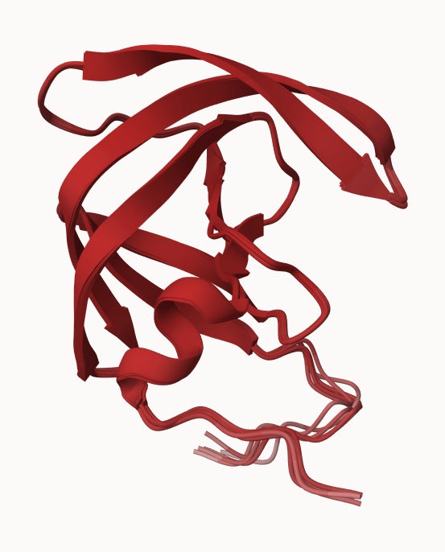

## Custom analysis of resulting models

``` r
library(bio3d)
results_dir <- "hivpr_dimer_23119/"
```

``` r
library(bio3d)
# File names for all PDB models
pdb_files <- list.files(path=results_dir,
                        pattern="*.pdb",
                        full.names = TRUE)
pdb_files
```

    [1] "hivpr_dimer_23119//hivpr_dimer_23119_unrelaxed_rank_001_alphafold2_multimer_v3_model_1_seed_000.pdb"
    [2] "hivpr_dimer_23119//hivpr_dimer_23119_unrelaxed_rank_002_alphafold2_multimer_v3_model_5_seed_000.pdb"
    [3] "hivpr_dimer_23119//hivpr_dimer_23119_unrelaxed_rank_003_alphafold2_multimer_v3_model_4_seed_000.pdb"
    [4] "hivpr_dimer_23119//hivpr_dimer_23119_unrelaxed_rank_004_alphafold2_multimer_v3_model_2_seed_000.pdb"
    [5] "hivpr_dimer_23119//hivpr_dimer_23119_unrelaxed_rank_005_alphafold2_multimer_v3_model_3_seed_000.pdb"

``` r
# Read all data from Models 
#  and superpose/fit coords
#pdbs <- pdbaln(pdb_files, fit=TRUE)
```

Previous code results in an error message.

``` r
# Optionally install the MSA package for use with pdbaln()
#install.packages("BiocManager")
#BiocManager::install("msa")

pdbs <- pdbaln(pdb_files, fit=TRUE, exefile="msa")
```

    Reading PDB files:
    hivpr_dimer_23119//hivpr_dimer_23119_unrelaxed_rank_001_alphafold2_multimer_v3_model_1_seed_000.pdb
    hivpr_dimer_23119//hivpr_dimer_23119_unrelaxed_rank_002_alphafold2_multimer_v3_model_5_seed_000.pdb
    hivpr_dimer_23119//hivpr_dimer_23119_unrelaxed_rank_003_alphafold2_multimer_v3_model_4_seed_000.pdb
    hivpr_dimer_23119//hivpr_dimer_23119_unrelaxed_rank_004_alphafold2_multimer_v3_model_2_seed_000.pdb
    hivpr_dimer_23119//hivpr_dimer_23119_unrelaxed_rank_005_alphafold2_multimer_v3_model_3_seed_000.pdb
    .....

    Extracting sequences

    pdb/seq: 1   name: hivpr_dimer_23119//hivpr_dimer_23119_unrelaxed_rank_001_alphafold2_multimer_v3_model_1_seed_000.pdb 
    pdb/seq: 2   name: hivpr_dimer_23119//hivpr_dimer_23119_unrelaxed_rank_002_alphafold2_multimer_v3_model_5_seed_000.pdb 
    pdb/seq: 3   name: hivpr_dimer_23119//hivpr_dimer_23119_unrelaxed_rank_003_alphafold2_multimer_v3_model_4_seed_000.pdb 
    pdb/seq: 4   name: hivpr_dimer_23119//hivpr_dimer_23119_unrelaxed_rank_004_alphafold2_multimer_v3_model_2_seed_000.pdb 
    pdb/seq: 5   name: hivpr_dimer_23119//hivpr_dimer_23119_unrelaxed_rank_005_alphafold2_multimer_v3_model_3_seed_000.pdb 

``` r
pdbs
```

                                   1        .         .         .         .         50 
    [Truncated_Name:1]hivpr_dime   PQITLWQRPLVTIKIGGQLKEALLDTGADDTVLEEMSLPGRWKPKMIGGI
    [Truncated_Name:2]hivpr_dime   PQITLWQRPLVTIKIGGQLKEALLDTGADDTVLEEMSLPGRWKPKMIGGI
    [Truncated_Name:3]hivpr_dime   PQITLWQRPLVTIKIGGQLKEALLDTGADDTVLEEMSLPGRWKPKMIGGI
    [Truncated_Name:4]hivpr_dime   PQITLWQRPLVTIKIGGQLKEALLDTGADDTVLEEMSLPGRWKPKMIGGI
    [Truncated_Name:5]hivpr_dime   PQITLWQRPLVTIKIGGQLKEALLDTGADDTVLEEMSLPGRWKPKMIGGI
                                   ************************************************** 
                                   1        .         .         .         .         50 

                                  51        .         .         .         .         100 
    [Truncated_Name:1]hivpr_dime   GGFIKVRQYDQILIEICGHKAIGTVLVGPTPVNIIGRNLLTQIGCTLNFP
    [Truncated_Name:2]hivpr_dime   GGFIKVRQYDQILIEICGHKAIGTVLVGPTPVNIIGRNLLTQIGCTLNFP
    [Truncated_Name:3]hivpr_dime   GGFIKVRQYDQILIEICGHKAIGTVLVGPTPVNIIGRNLLTQIGCTLNFP
    [Truncated_Name:4]hivpr_dime   GGFIKVRQYDQILIEICGHKAIGTVLVGPTPVNIIGRNLLTQIGCTLNFP
    [Truncated_Name:5]hivpr_dime   GGFIKVRQYDQILIEICGHKAIGTVLVGPTPVNIIGRNLLTQIGCTLNFP
                                   ************************************************** 
                                  51        .         .         .         .         100 

                                 101        .         .         .         .         150 
    [Truncated_Name:1]hivpr_dime   QITLWQRPLVTIKIGGQLKEALLDTGADDTVLEEMSLPGRWKPKMIGGIG
    [Truncated_Name:2]hivpr_dime   QITLWQRPLVTIKIGGQLKEALLDTGADDTVLEEMSLPGRWKPKMIGGIG
    [Truncated_Name:3]hivpr_dime   QITLWQRPLVTIKIGGQLKEALLDTGADDTVLEEMSLPGRWKPKMIGGIG
    [Truncated_Name:4]hivpr_dime   QITLWQRPLVTIKIGGQLKEALLDTGADDTVLEEMSLPGRWKPKMIGGIG
    [Truncated_Name:5]hivpr_dime   QITLWQRPLVTIKIGGQLKEALLDTGADDTVLEEMSLPGRWKPKMIGGIG
                                   ************************************************** 
                                 101        .         .         .         .         150 

                                 151        .         .         .         .       198 
    [Truncated_Name:1]hivpr_dime   GFIKVRQYDQILIEICGHKAIGTVLVGPTPVNIIGRNLLTQIGCTLNF
    [Truncated_Name:2]hivpr_dime   GFIKVRQYDQILIEICGHKAIGTVLVGPTPVNIIGRNLLTQIGCTLNF
    [Truncated_Name:3]hivpr_dime   GFIKVRQYDQILIEICGHKAIGTVLVGPTPVNIIGRNLLTQIGCTLNF
    [Truncated_Name:4]hivpr_dime   GFIKVRQYDQILIEICGHKAIGTVLVGPTPVNIIGRNLLTQIGCTLNF
    [Truncated_Name:5]hivpr_dime   GFIKVRQYDQILIEICGHKAIGTVLVGPTPVNIIGRNLLTQIGCTLNF
                                   ************************************************ 
                                 151        .         .         .         .       198 

    Call:
      pdbaln(files = pdb_files, fit = TRUE, exefile = "msa")

    Class:
      pdbs, fasta

    Alignment dimensions:
      5 sequence rows; 198 position columns (198 non-gap, 0 gap) 

    + attr: xyz, resno, b, chain, id, ali, resid, sse, call

Calculate the RMSD between all models.

``` r
rd <- rmsd(pdbs)
```

    Warning in rmsd(pdbs): No indices provided, using the 198 non NA positions

``` r
range(rd)
```

    [1]  0.000 20.432

``` r
library(pheatmap)

colnames(rd) <- paste0("m",1:5)
rownames(rd) <- paste0("m",1:5)
pheatmap(rd)
```

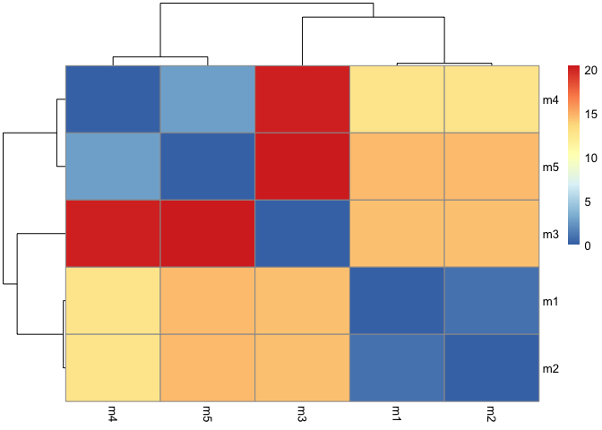

``` r
# Read a reference PDB structure
pdb <- read.pdb("1hsg")
```

      Note: Accessing on-line PDB file

``` r
plotb3(pdbs$b, typ="l", lwd=2, sse=pdb)
points(pdbs$b[2,], typ="l", col="red")
points(pdbs$b[3,], typ="l", col="blue")
points(pdbs$b[4,], typ="l", col="darkgreen")
points(pdbs$b[5,], typ="l", col="orange")
abline(v=100, col="gray")
```

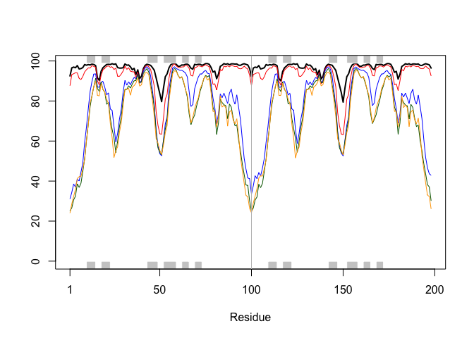

Improve the superposition/fitting of our models by finding the most
consistent “rigid core” common across all the models. For this we will
use the core.find() function:

``` r
core <- core.find(pdbs)
```

     core size 197 of 198  vol = 6119.978 
     core size 196 of 198  vol = 5369.631 
     core size 195 of 198  vol = 5007.166 
     core size 194 of 198  vol = 4736.496 
     core size 193 of 198  vol = 4457.094 
     core size 192 of 198  vol = 4232.564 
     core size 191 of 198  vol = 4012.815 
     core size 190 of 198  vol = 3810.213 
     core size 189 of 198  vol = 3678.285 
     core size 188 of 198  vol = 3549.395 
     core size 187 of 198  vol = 3431.938 
     core size 186 of 198  vol = 3316.333 
     core size 185 of 198  vol = 3243.309 
     core size 184 of 198  vol = 3149.827 
     core size 183 of 198  vol = 3078.402 
     core size 182 of 198  vol = 3019.868 
     core size 181 of 198  vol = 2958.106 
     core size 180 of 198  vol = 2927.306 
     core size 179 of 198  vol = 2899.182 
     core size 178 of 198  vol = 2898.894 
     core size 177 of 198  vol = 2915.917 
     core size 176 of 198  vol = 2933.733 
     core size 175 of 198  vol = 2948.254 
     core size 174 of 198  vol = 2979.453 
     core size 173 of 198  vol = 2999.025 
     core size 172 of 198  vol = 2979.648 
     core size 171 of 198  vol = 2964.773 
     core size 170 of 198  vol = 2942.972 
     core size 169 of 198  vol = 2908.3 
     core size 168 of 198  vol = 2864.574 
     core size 167 of 198  vol = 2821.943 
     core size 166 of 198  vol = 2778.522 
     core size 165 of 198  vol = 2710.333 
     core size 164 of 198  vol = 2641.042 
     core size 163 of 198  vol = 2579.594 
     core size 162 of 198  vol = 2513.106 
     core size 161 of 198  vol = 2429.205 
     core size 160 of 198  vol = 2345.942 
     core size 159 of 198  vol = 2272.876 
     core size 158 of 198  vol = 2204.156 
     core size 157 of 198  vol = 2140.014 
     core size 156 of 198  vol = 2050.59 
     core size 155 of 198  vol = 1983.639 
     core size 154 of 198  vol = 1907.44 
     core size 153 of 198  vol = 1845.477 
     core size 152 of 198  vol = 1769.722 
     core size 151 of 198  vol = 1709.078 
     core size 150 of 198  vol = 1636.924 
     core size 149 of 198  vol = 1579.485 
     core size 148 of 198  vol = 1509.587 
     core size 147 of 198  vol = 1456.495 
     core size 146 of 198  vol = 1398.53 
     core size 145 of 198  vol = 1341.387 
     core size 144 of 198  vol = 1293.081 
     core size 143 of 198  vol = 1248.378 
     core size 142 of 198  vol = 1193.388 
     core size 141 of 198  vol = 1140.285 
     core size 140 of 198  vol = 1098.208 
     core size 139 of 198  vol = 1061.118 
     core size 138 of 198  vol = 1015.106 
     core size 137 of 198  vol = 978.862 
     core size 136 of 198  vol = 933.985 
     core size 135 of 198  vol = 889.711 
     core size 134 of 198  vol = 848.21 
     core size 133 of 198  vol = 804.689 
     core size 132 of 198  vol = 768.031 
     core size 131 of 198  vol = 724.517 
     core size 130 of 198  vol = 684.306 
     core size 129 of 198  vol = 644.893 
     core size 128 of 198  vol = 609.842 
     core size 127 of 198  vol = 568.284 
     core size 126 of 198  vol = 536.469 
     core size 125 of 198  vol = 506.102 
     core size 124 of 198  vol = 486.685 
     core size 123 of 198  vol = 462.316 
     core size 122 of 198  vol = 431.163 
     core size 121 of 198  vol = 404.541 
     core size 120 of 198  vol = 373.619 
     core size 119 of 198  vol = 348.087 
     core size 118 of 198  vol = 325.641 
     core size 117 of 198  vol = 302.829 
     core size 116 of 198  vol = 284.101 
     core size 115 of 198  vol = 260.484 
     core size 114 of 198  vol = 245.38 
     core size 113 of 198  vol = 230.906 
     core size 112 of 198  vol = 212.841 
     core size 111 of 198  vol = 198.554 
     core size 110 of 198  vol = 182.254 
     core size 109 of 198  vol = 172.636 
     core size 108 of 198  vol = 161.91 
     core size 107 of 198  vol = 152.145 
     core size 106 of 198  vol = 141.393 
     core size 105 of 198  vol = 131.934 
     core size 104 of 198  vol = 123.075 
     core size 103 of 198  vol = 112.898 
     core size 102 of 198  vol = 101.096 
     core size 101 of 198  vol = 90.574 
     core size 100 of 198  vol = 79.79 
     core size 99 of 198  vol = 70.252 
     core size 98 of 198  vol = 63.673 
     core size 97 of 198  vol = 58.103 
     core size 96 of 198  vol = 49.453 
     core size 95 of 198  vol = 40.86 
     core size 94 of 198  vol = 30.175 
     core size 93 of 198  vol = 22.974 
     core size 92 of 198  vol = 14.316 
     core size 91 of 198  vol = 9.184 
     core size 90 of 198  vol = 5.133 
     core size 89 of 198  vol = 3.603 
     core size 88 of 198  vol = 2.705 
     core size 87 of 198  vol = 2.032 
     core size 86 of 198  vol = 1.404 
     core size 85 of 198  vol = 1.211 
     core size 84 of 198  vol = 1.073 
     core size 83 of 198  vol = 0.925 
     core size 82 of 198  vol = 0.788 
     core size 81 of 198  vol = 0.651 
     core size 80 of 198  vol = 0.528 
     core size 79 of 198  vol = 0.486 
     FINISHED: Min vol ( 0.5 ) reached

Use the identified core atom positions as a basis for a more suitable
superposition:

``` r
core.inds <- print(core, vol=0.5)
```

    # 80 positions (cumulative volume <= 0.5 Angstrom^3) 
      start end length
    1    10  25     16
    2    27  48     22
    3    53  94     42

``` r
xyz <- pdbfit(pdbs, core.inds, outpath="corefit_structures")
```

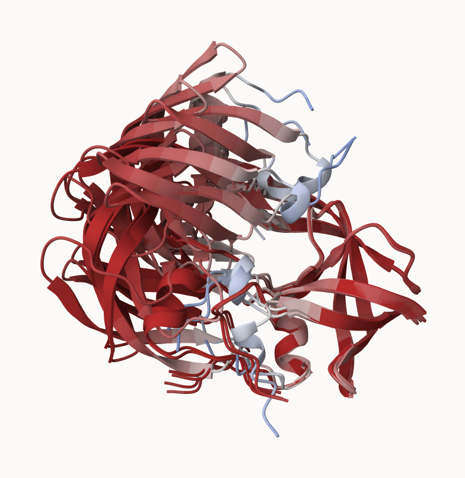

``` r
rd <- rmsd(xyz)
```

    Warning in rmsd(xyz): No indices provided, using the 198 non NA positions

``` r
# Change the names for easy reference
colnames(rd) <- paste0("m",1:5)
rownames(rd) <- paste0("m",1:5)
pheatmap(rd)
```

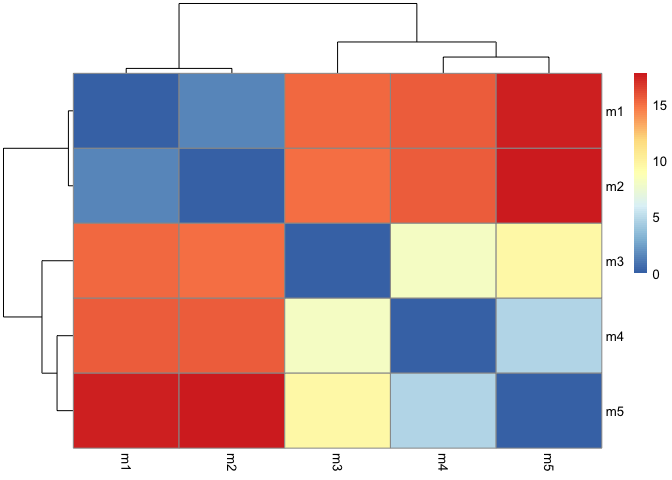

``` r
rf <- rmsf(xyz)

plotb3(rf, sse=pdb)
abline(v=100, col="gray", ylab="RMSF")
```

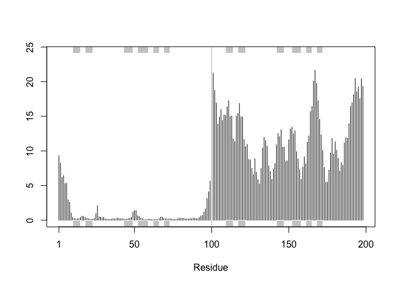

Predicted Alignment Error (PAE) for domains

``` r
library(jsonlite)

# Listing of all PAE JSON files
pae_files <- list.files(path=results_dir,
                        pattern=".*model.*\\.json",
                        full.names = TRUE)
```

``` r
pae1 <- read_json(pae_files[1],simplifyVector = TRUE)
pae5 <- read_json(pae_files[5],simplifyVector = TRUE)

attributes(pae1)
```

    $names
    [1] "plddt"   "max_pae" "pae"     "ptm"     "iptm"   

``` r
# Per-residue pLDDT scores 
#  same as B-factor of PDB..
head(pae1$plddt) 
```

    [1] 92.50 96.56 96.94 96.62 97.69 96.00

For PAE values the lower the better

Plot these with ggplot or with functions from the Bio3D package:

``` r
plot.dmat(pae1$pae, 
          xlab="Residue Position (i)",
          ylab="Residue Position (j)")
```

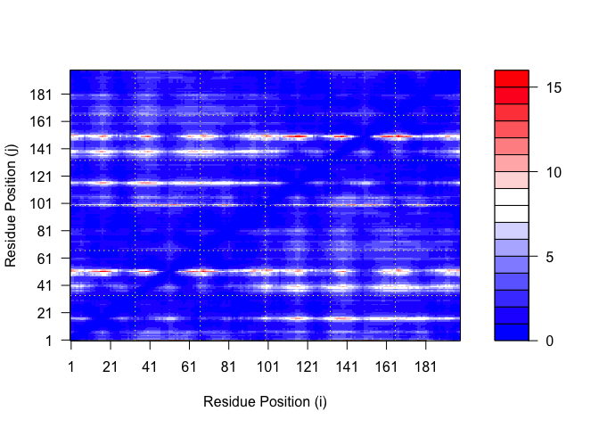

Plot with `plot.dmat()` function

``` r
plot.dmat(pae5$pae, 
          xlab="Residue Position (i)",
          ylab="Residue Position (j)",
          grid.col = "black",
          zlim=c(0,30))
```

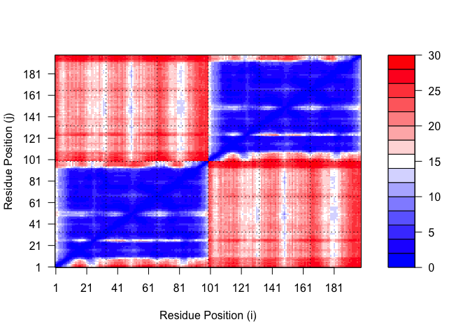

``` r
plot.dmat(pae1$pae, 
          xlab="Residue Position (i)",
          ylab="Residue Position (j)",
          grid.col = "black",
          zlim=c(0,30))
```

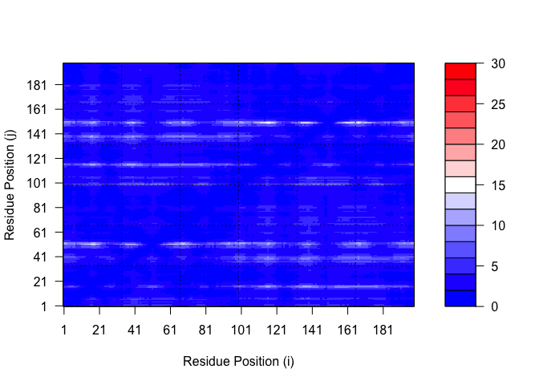

The residue conservation from alignment file

``` r
aln_file <- list.files(path=results_dir,
                       pattern=".a3m$",
                        full.names = TRUE)
aln_file
```

    [1] "hivpr_dimer_23119//hivpr_dimer_23119.a3m"

``` r
aln <- read.fasta(aln_file[1], to.upper = TRUE)
```

    [1] " ** Duplicated sequence id's: 101 **"
    [2] " ** Duplicated sequence id's: 101 **"

``` r
dim(aln$ali)
```

    [1] 5378  132

Score residue conservation in the alignment with the `conserv()`
function.

``` r
sim <- conserv(aln)
plotb3(sim[1:99], sse=trim.pdb(pdb, chain="A"))
```

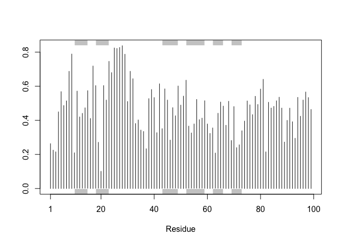

``` r
con <- consensus(aln, cutoff = 0.9)
con$seq
```

      [1] "-" "-" "-" "-" "-" "-" "-" "-" "-" "-" "-" "-" "-" "-" "-" "-" "-" "-"
     [19] "-" "-" "-" "-" "-" "-" "D" "T" "G" "A" "-" "-" "-" "-" "-" "-" "-" "-"
     [37] "-" "-" "-" "-" "-" "-" "-" "-" "-" "-" "-" "-" "-" "-" "-" "-" "-" "-"
     [55] "-" "-" "-" "-" "-" "-" "-" "-" "-" "-" "-" "-" "-" "-" "-" "-" "-" "-"
     [73] "-" "-" "-" "-" "-" "-" "-" "-" "-" "-" "-" "-" "-" "-" "-" "-" "-" "-"
     [91] "-" "-" "-" "-" "-" "-" "-" "-" "-" "-" "-" "-" "-" "-" "-" "-" "-" "-"
    [109] "-" "-" "-" "-" "-" "-" "-" "-" "-" "-" "-" "-" "-" "-" "-" "-" "-" "-"
    [127] "-" "-" "-" "-" "-" "-"

``` r
m1.pdb <- read.pdb(pdb_files[1])
occ <- vec2resno(c(sim[1:99], sim[1:99]), m1.pdb$atom$resno)
write.pdb(m1.pdb, o=occ, file="m1_conserv.pdb")
```

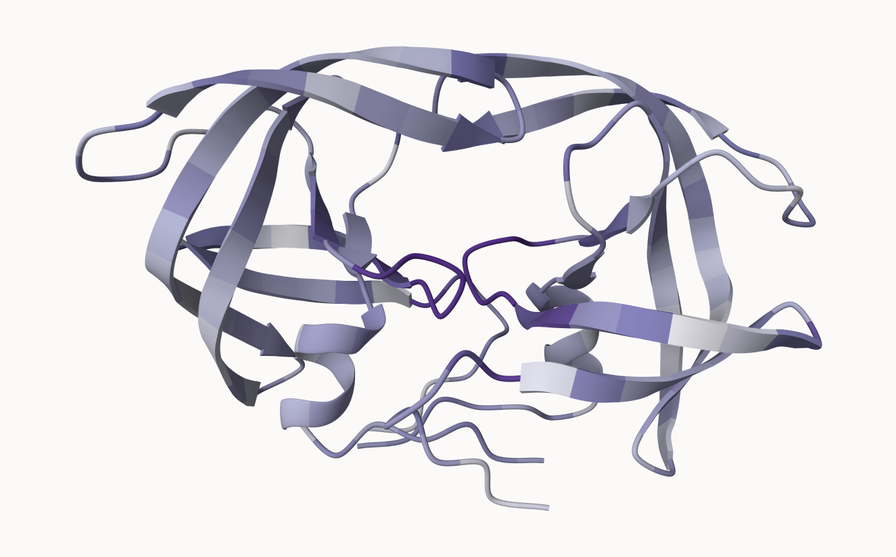
