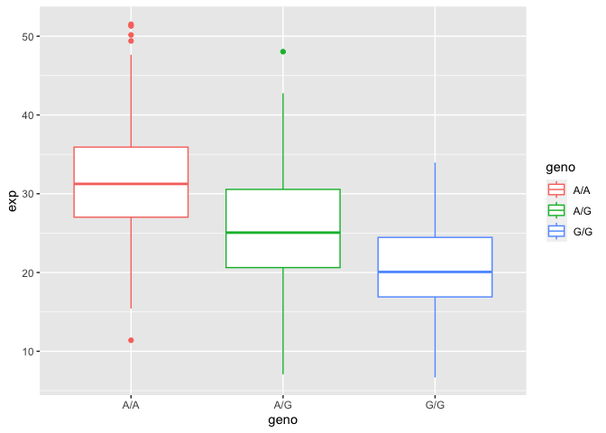

# Population Analysis (Q13 & Q14)
Lena (A16420052)

## Section 4: Population Scale Analysis

``` r
expr <- read.table("rs8067378_ENSG00000172057.6.txt")
head(expr)
```

       sample geno      exp
    1 HG00367  A/G 28.96038
    2 NA20768  A/G 20.24449
    3 HG00361  A/A 31.32628
    4 HG00135  A/A 34.11169
    5 NA18870  G/G 18.25141
    6 NA11993  A/A 32.89721

``` r
#how many individuals there are 
nrow(expr)
```

    [1] 462

``` r
#how many of each genotype
table(expr$geno)
```


    A/A A/G G/G 
    108 233 121 

### Summary Figure

Using ggplot which function(); grooup by

``` r
library(ggplot2)
ggplot(expr, aes(geno, exp, col= geno)) + geom_boxplot()
```



The SNP does affect gene expression; G\|G genotype results in lowered
expression.
