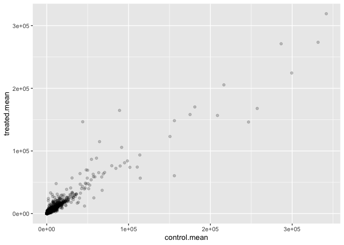
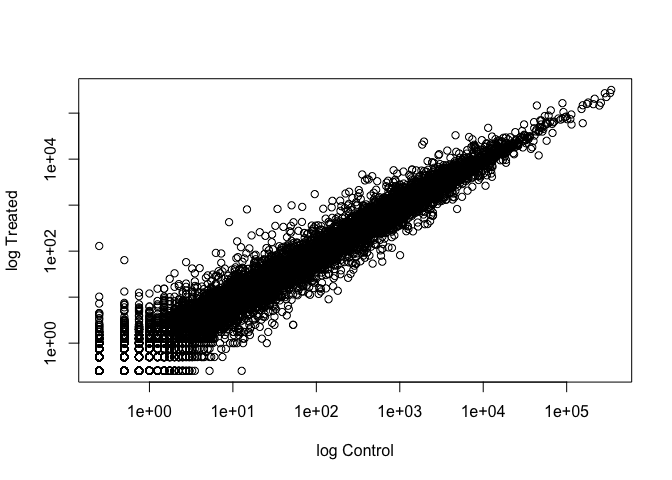
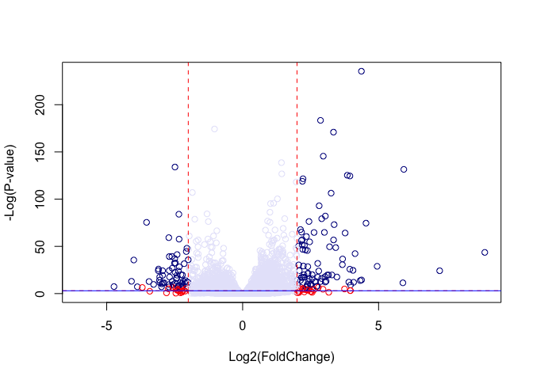

# Class 13
Lena (A16420052)

``` r
library(DESeq2)
```

    Loading required package: S4Vectors

    Warning: package 'S4Vectors' was built under R version 4.3.2

    Loading required package: stats4

    Loading required package: BiocGenerics


    Attaching package: 'BiocGenerics'

    The following objects are masked from 'package:stats':

        IQR, mad, sd, var, xtabs

    The following objects are masked from 'package:base':

        anyDuplicated, aperm, append, as.data.frame, basename, cbind,
        colnames, dirname, do.call, duplicated, eval, evalq, Filter, Find,
        get, grep, grepl, intersect, is.unsorted, lapply, Map, mapply,
        match, mget, order, paste, pmax, pmax.int, pmin, pmin.int,
        Position, rank, rbind, Reduce, rownames, sapply, setdiff, sort,
        table, tapply, union, unique, unsplit, which.max, which.min


    Attaching package: 'S4Vectors'

    The following object is masked from 'package:utils':

        findMatches

    The following objects are masked from 'package:base':

        expand.grid, I, unname

    Loading required package: IRanges

    Loading required package: GenomicRanges

    Loading required package: GenomeInfoDb

    Warning: package 'GenomeInfoDb' was built under R version 4.3.2

    Loading required package: SummarizedExperiment

    Loading required package: MatrixGenerics

    Loading required package: matrixStats


    Attaching package: 'MatrixGenerics'

    The following objects are masked from 'package:matrixStats':

        colAlls, colAnyNAs, colAnys, colAvgsPerRowSet, colCollapse,
        colCounts, colCummaxs, colCummins, colCumprods, colCumsums,
        colDiffs, colIQRDiffs, colIQRs, colLogSumExps, colMadDiffs,
        colMads, colMaxs, colMeans2, colMedians, colMins, colOrderStats,
        colProds, colQuantiles, colRanges, colRanks, colSdDiffs, colSds,
        colSums2, colTabulates, colVarDiffs, colVars, colWeightedMads,
        colWeightedMeans, colWeightedMedians, colWeightedSds,
        colWeightedVars, rowAlls, rowAnyNAs, rowAnys, rowAvgsPerColSet,
        rowCollapse, rowCounts, rowCummaxs, rowCummins, rowCumprods,
        rowCumsums, rowDiffs, rowIQRDiffs, rowIQRs, rowLogSumExps,
        rowMadDiffs, rowMads, rowMaxs, rowMeans2, rowMedians, rowMins,
        rowOrderStats, rowProds, rowQuantiles, rowRanges, rowRanks,
        rowSdDiffs, rowSds, rowSums2, rowTabulates, rowVarDiffs, rowVars,
        rowWeightedMads, rowWeightedMeans, rowWeightedMedians,
        rowWeightedSds, rowWeightedVars

    Loading required package: Biobase

    Welcome to Bioconductor

        Vignettes contain introductory material; view with
        'browseVignettes()'. To cite Bioconductor, see
        'citation("Biobase")', and for packages 'citation("pkgname")'.


    Attaching package: 'Biobase'

    The following object is masked from 'package:MatrixGenerics':

        rowMedians

    The following objects are masked from 'package:matrixStats':

        anyMissing, rowMedians

Today we will examine RNA seq data from Himes et al.

## Input countData and colData

``` r
counts <- read.csv("airway_scaledcounts.csv", row.names=1)
metadata <-read.csv("airway_metadata.csv")
head(counts)
```

                    SRR1039508 SRR1039509 SRR1039512 SRR1039513 SRR1039516
    ENSG00000000003        723        486        904        445       1170
    ENSG00000000005          0          0          0          0          0
    ENSG00000000419        467        523        616        371        582
    ENSG00000000457        347        258        364        237        318
    ENSG00000000460         96         81         73         66        118
    ENSG00000000938          0          0          1          0          2
                    SRR1039517 SRR1039520 SRR1039521
    ENSG00000000003       1097        806        604
    ENSG00000000005          0          0          0
    ENSG00000000419        781        417        509
    ENSG00000000457        447        330        324
    ENSG00000000460         94        102         74
    ENSG00000000938          0          0          0

``` r
head(metadata)
```

              id     dex celltype     geo_id
    1 SRR1039508 control   N61311 GSM1275862
    2 SRR1039509 treated   N61311 GSM1275863
    3 SRR1039512 control  N052611 GSM1275866
    4 SRR1039513 treated  N052611 GSM1275867
    5 SRR1039516 control  N080611 GSM1275870
    6 SRR1039517 treated  N080611 GSM1275871

> Q1. How many genes are in this dataset?

``` r
nrow(counts)
```

    [1] 38694

> Q2. How many ‘control’ cell lines do we have?

``` r
sum(metadata$dex== "control")
```

    [1] 4

``` r
# can use table() function as well
table(metadata$dex)
```


    control treated 
          4       4 

## Toy differential gene expression

Lets perform some exploratory differential gene expression analysis -
step 1: find which columns in `counts` correspond to “control” samples
-step 2: calculate the mean value per gene in these columns -step 3:
store my answer for later in `control.mean`

This calculates the mean counts per gene across these samples:

``` r
#control <- metadata[metadata[,"dex"]=="control",]
#control.counts <- counts[ ,control$id]
#control.mean <- rowSums( control.counts )/4 
#head(control.mean)
```

Using dplyr instead

``` r
library(dplyr)
```


    Attaching package: 'dplyr'

    The following object is masked from 'package:Biobase':

        combine

    The following object is masked from 'package:matrixStats':

        count

    The following objects are masked from 'package:GenomicRanges':

        intersect, setdiff, union

    The following object is masked from 'package:GenomeInfoDb':

        intersect

    The following objects are masked from 'package:IRanges':

        collapse, desc, intersect, setdiff, slice, union

    The following objects are masked from 'package:S4Vectors':

        first, intersect, rename, setdiff, setequal, union

    The following objects are masked from 'package:BiocGenerics':

        combine, intersect, setdiff, union

    The following objects are masked from 'package:stats':

        filter, lag

    The following objects are masked from 'package:base':

        intersect, setdiff, setequal, union

``` r
#filter by $dex in metadata by "control"
control <- metadata %>% filter(dex=="control")
#select from id that are controls from count
control.counts <- counts %>% select(control$id) 
control.mean <- rowSums(control.counts)/4
head(control.mean)
```

    ENSG00000000003 ENSG00000000005 ENSG00000000419 ENSG00000000457 ENSG00000000460 
             900.75            0.00          520.50          339.75           97.25 
    ENSG00000000938 
               0.75 

> Q3. How would you make the above code in either approach more robust?
> Is there a function that could help here?

We can use `rowMeans()` instead of `rowSums(control.counts)/4` to make
the code more robust.

``` r
#barry's code
control.inds <- metadata$dex=="control"
metadata[control.inds, ]
```

              id     dex celltype     geo_id
    1 SRR1039508 control   N61311 GSM1275862
    3 SRR1039512 control  N052611 GSM1275866
    5 SRR1039516 control  N080611 GSM1275870
    7 SRR1039520 control  N061011 GSM1275874

``` r
control.counts <- counts[, control.inds]
head(control.counts)
```

                    SRR1039508 SRR1039512 SRR1039516 SRR1039520
    ENSG00000000003        723        904       1170        806
    ENSG00000000005          0          0          0          0
    ENSG00000000419        467        616        582        417
    ENSG00000000457        347        364        318        330
    ENSG00000000460         96         73        118        102
    ENSG00000000938          0          1          2          0

``` r
#apply(control.counts, 1, mean)
control.mean <- rowMeans(control.counts)
```

> Q4. Follow the same procedure for the treated samples (i.e. calculate
> the mean per gene across drug treated samples and assign to a labeled
> vector called treated.mean)

``` r
treated <- metadata[metadata[,"dex"]=="treated",]
treated.mean <- ( counts[ ,treated$id] ) 
```

using dplyr…

``` r
#treated <- metadata %>% filter(dex=="treated")
#treated.counts <- counts %>% select(control$id)
#treated.mean <- rowMeans(treated.counts)
#head(treated.mean)
```

``` r
treated.mean <- rowMeans(counts[, metadata$dex=="treated"])
head(treated.mean)
```

    ENSG00000000003 ENSG00000000005 ENSG00000000419 ENSG00000000457 ENSG00000000460 
             658.00            0.00          546.00          316.50           78.75 
    ENSG00000000938 
               0.00 

To keep us tidy lets put `control.mean` and `treated.mean` vectors
together as two columns of a new data frame

``` r
meancounts <- data.frame(control.mean, treated.mean)
head(meancounts)
```

                    control.mean treated.mean
    ENSG00000000003       900.75       658.00
    ENSG00000000005         0.00         0.00
    ENSG00000000419       520.50       546.00
    ENSG00000000457       339.75       316.50
    ENSG00000000460        97.25        78.75
    ENSG00000000938         0.75         0.00

``` r
colSums(meancounts)
```

    control.mean treated.mean 
        23005324     22196524 

> Q5 (a). Create a scatter plot showing the mean of the treated samples
> against the mean of the control samples. Your plot should look
> something like the following.

``` r
library(ggplot2)
ggplot(meancounts, aes(control.mean,treated.mean)) + geom_point()
```


> Q5 (b).You could also use the ggplot2 package to make this figure
> producing the plot below. What geom\_?() function would you use for
> this plot?

``` r
ggplot(meancounts, aes(control.mean, treated.mean)) + geom_point(alpha=0.2)
```



> Q6. Try plotting both axes on a log scale. What is the argument to
> plot() that allows you to do this?

``` r
plot(meancounts, log="xy", xlab= "log Control", ylab= "log Treated")
```

    Warning in xy.coords(x, y, xlabel, ylabel, log): 15032 x values <= 0 omitted
    from logarithmic plot

    Warning in xy.coords(x, y, xlabel, ylabel, log): 15281 y values <= 0 omitted
    from logarithmic plot



Log transformations are super useful when our data is skewed and
measured over a wide range like this. We can use different log
transformations like base10 or natural logs but we most often prefer
log2 units

``` r
#Treated/Control
log2(10/10)
```

    [1] 0

``` r
#what if there was a doubling 
log2(10/20)
```

    [1] -1

``` r
log2(20/10)
```

    [1] 1

``` r
log2(40/10)
```

    [1] 2

Lets add a log2 fold-change colum to our little `mean.counts()`
data.frame:

``` r
meancounts$log2fc <- log2(meancounts$treated.mean/
                            meancounts$control.mean)
head(meancounts)
```

                    control.mean treated.mean      log2fc
    ENSG00000000003       900.75       658.00 -0.45303916
    ENSG00000000005         0.00         0.00         NaN
    ENSG00000000419       520.50       546.00  0.06900279
    ENSG00000000457       339.75       316.50 -0.10226805
    ENSG00000000460        97.25        78.75 -0.30441833
    ENSG00000000938         0.75         0.00        -Inf

``` r
meancounts$log2fc <- log2(meancounts[,"treated.mean"]/meancounts[,"control.mean"])
head(meancounts)
```

                    control.mean treated.mean      log2fc
    ENSG00000000003       900.75       658.00 -0.45303916
    ENSG00000000005         0.00         0.00         NaN
    ENSG00000000419       520.50       546.00  0.06900279
    ENSG00000000457       339.75       316.50 -0.10226805
    ENSG00000000460        97.25        78.75 -0.30441833
    ENSG00000000938         0.75         0.00        -Inf

There are a couple of “weird” results. Namely, the NaN (“not a number”)
and -Inf (negative infinity) results.

The NaN is returned when you divide by zero and try to take the log. The
-Inf is returned when you try to take the log of zero. It turns out that
there are a lot of genes with zero expression. Let’s filter our data to
remove these genes.

``` r
zero.vals <- which(meancounts[,1:2]==0, arr.ind=TRUE)

to.rm <- unique(zero.vals[,1])
mycounts <- meancounts[-to.rm,]
head(mycounts)
```

                    control.mean treated.mean      log2fc
    ENSG00000000003       900.75       658.00 -0.45303916
    ENSG00000000419       520.50       546.00  0.06900279
    ENSG00000000457       339.75       316.50 -0.10226805
    ENSG00000000460        97.25        78.75 -0.30441833
    ENSG00000000971      5219.00      6687.50  0.35769358
    ENSG00000001036      2327.00      1785.75 -0.38194109

``` r
#gets rid of any genes that are true (==1)
to.rm.inds <- rowSums(meancounts[, 1:2]==0)>0
head(meancounts[!to.rm.inds, ])
```

                    control.mean treated.mean      log2fc
    ENSG00000000003       900.75       658.00 -0.45303916
    ENSG00000000419       520.50       546.00  0.06900279
    ENSG00000000457       339.75       316.50 -0.10226805
    ENSG00000000460        97.25        78.75 -0.30441833
    ENSG00000000971      5219.00      6687.50  0.35769358
    ENSG00000001036      2327.00      1785.75 -0.38194109

The `!` mark flips TRUE value to FALSE and vice versa…

``` r
random_var <- c(T, F, T)
which(random_var)
```

    [1] 1 3

``` r
!random_var
```

    [1] FALSE  TRUE FALSE

``` r
head(mycounts)
```

                    control.mean treated.mean      log2fc
    ENSG00000000003       900.75       658.00 -0.45303916
    ENSG00000000419       520.50       546.00  0.06900279
    ENSG00000000457       339.75       316.50 -0.10226805
    ENSG00000000460        97.25        78.75 -0.30441833
    ENSG00000000971      5219.00      6687.50  0.35769358
    ENSG00000001036      2327.00      1785.75 -0.38194109

``` r
dim(mycounts)
```

    [1] 21817     3

> Q7. What is the purpose of the arr.ind argument in the which()
> function call above? Why would we then take the first column of the
> output and need to call the unique() function?

The purpose of arr.ind=TRUE argument is to have the which() function
return row and column indices where they equal TRUE. Calling the
unique() function will help us make sure we do not count any rows twice
if it has zero entries in both samples.

genes(row) samples(column)

A common threshold used for calling something differentially expressed
is a log2(FoldChange) of greater than 2 or less than -2. Let’s filter
the dataset both ways to see how many genes are up or down-regulated.

``` r
up.ind <- mycounts$log2fc > 2
down.ind <- mycounts$log2fc < (-2)
```

> Q8. Using the up.ind vector above can you determine how many up
> regulated genes we have at the greater than 2 fc level?

``` r
sum(up.ind)
```

    [1] 250

There are 250 up regulated genes that are greater than 2 fc level. \>
Q9. Using the down.ind vector above can you determine how many down
regulated genes we have at the greater than 2 fc level?

``` r
sum(down.ind)
```

    [1] 367

There are 367 down regulated genes that are greater than 2 fc level.

> Q10. Do you trust these results? Why or why not?

No I do not trust these results. Analysis has been based on large fold
changes, but we are forgetting about statistical significance of these
differences.

## Setting up for DESeq

We will now use DEseq2 package to do this analysis properly

``` r
#call DEseq package
library(DESeq2)

dds <- DESeqDataSetFromMatrix(countData = counts, 
                       colData = metadata , 
                       design= ~dex
                       )
```

    converting counts to integer mode

    Warning in DESeqDataSet(se, design = design, ignoreRank): some variables in
    design formula are characters, converting to factors

### Importing data

``` r
dds <- DESeq(dds)
```

    estimating size factors

    estimating dispersions

    gene-wise dispersion estimates

    mean-dispersion relationship

    final dispersion estimates

    fitting model and testing

Get our results back from the `dds` object

``` r
res <- results(dds)
head(res)
```

    log2 fold change (MLE): dex treated vs control 
    Wald test p-value: dex treated vs control 
    DataFrame with 6 rows and 6 columns
                      baseMean log2FoldChange     lfcSE      stat    pvalue
                     <numeric>      <numeric> <numeric> <numeric> <numeric>
    ENSG00000000003 747.194195     -0.3507030  0.168246 -2.084470 0.0371175
    ENSG00000000005   0.000000             NA        NA        NA        NA
    ENSG00000000419 520.134160      0.2061078  0.101059  2.039475 0.0414026
    ENSG00000000457 322.664844      0.0245269  0.145145  0.168982 0.8658106
    ENSG00000000460  87.682625     -0.1471420  0.257007 -0.572521 0.5669691
    ENSG00000000938   0.319167     -1.7322890  3.493601 -0.495846 0.6200029
                         padj
                    <numeric>
    ENSG00000000003  0.163035
    ENSG00000000005        NA
    ENSG00000000419  0.176032
    ENSG00000000457  0.961694
    ENSG00000000460  0.815849
    ENSG00000000938        NA

## Adding annotation data

We will use one of Bioconductor’s main annotation packages to help with
mapping between various ID schemes and add the necessary annotation data
to our results.

``` r
library("AnnotationDbi")
```

    Warning: package 'AnnotationDbi' was built under R version 4.3.2


    Attaching package: 'AnnotationDbi'

    The following object is masked from 'package:dplyr':

        select

``` r
library("org.Hs.eg.db")
```

``` r
columns(org.Hs.eg.db)
```

     [1] "ACCNUM"       "ALIAS"        "ENSEMBL"      "ENSEMBLPROT"  "ENSEMBLTRANS"
     [6] "ENTREZID"     "ENZYME"       "EVIDENCE"     "EVIDENCEALL"  "GENENAME"    
    [11] "GENETYPE"     "GO"           "GOALL"        "IPI"          "MAP"         
    [16] "OMIM"         "ONTOLOGY"     "ONTOLOGYALL"  "PATH"         "PFAM"        
    [21] "PMID"         "PROSITE"      "REFSEQ"       "SYMBOL"       "UCSCKG"      
    [26] "UNIPROT"     

The main function we will use here is called `mapIds()`

Our current IDs are here:

``` r
#mapIds()
head(row.names(res))
```

    [1] "ENSG00000000003" "ENSG00000000005" "ENSG00000000419" "ENSG00000000457"
    [5] "ENSG00000000460" "ENSG00000000938"

``` r
res$symbol <- mapIds(org.Hs.eg.db,
                     keys=row.names(res), # Our genenames
                     keytype="ENSEMBL",   # The format of our genenames
                     column="SYMBOL",     # The new format we want to add
                     multiVals="first")
```

    'select()' returned 1:many mapping between keys and columns

``` r
head(res)
```

    log2 fold change (MLE): dex treated vs control 
    Wald test p-value: dex treated vs control 
    DataFrame with 6 rows and 7 columns
                      baseMean log2FoldChange     lfcSE      stat    pvalue
                     <numeric>      <numeric> <numeric> <numeric> <numeric>
    ENSG00000000003 747.194195     -0.3507030  0.168246 -2.084470 0.0371175
    ENSG00000000005   0.000000             NA        NA        NA        NA
    ENSG00000000419 520.134160      0.2061078  0.101059  2.039475 0.0414026
    ENSG00000000457 322.664844      0.0245269  0.145145  0.168982 0.8658106
    ENSG00000000460  87.682625     -0.1471420  0.257007 -0.572521 0.5669691
    ENSG00000000938   0.319167     -1.7322890  3.493601 -0.495846 0.6200029
                         padj      symbol
                    <numeric> <character>
    ENSG00000000003  0.163035      TSPAN6
    ENSG00000000005        NA        TNMD
    ENSG00000000419  0.176032        DPM1
    ENSG00000000457  0.961694       SCYL3
    ENSG00000000460  0.815849       FIRRM
    ENSG00000000938        NA         FGR

Lets add GENENAME

``` r
res$genename <- mapIds(org.Hs.eg.db,
                     keys=row.names(res), # Our genenames
                     keytype="ENSEMBL",   # The format of our genenames
                     column="GENENAME",     # The new format we want to add
                     multiVals="first")
```

    'select()' returned 1:many mapping between keys and columns

``` r
head(res)
```

    log2 fold change (MLE): dex treated vs control 
    Wald test p-value: dex treated vs control 
    DataFrame with 6 rows and 8 columns
                      baseMean log2FoldChange     lfcSE      stat    pvalue
                     <numeric>      <numeric> <numeric> <numeric> <numeric>
    ENSG00000000003 747.194195     -0.3507030  0.168246 -2.084470 0.0371175
    ENSG00000000005   0.000000             NA        NA        NA        NA
    ENSG00000000419 520.134160      0.2061078  0.101059  2.039475 0.0414026
    ENSG00000000457 322.664844      0.0245269  0.145145  0.168982 0.8658106
    ENSG00000000460  87.682625     -0.1471420  0.257007 -0.572521 0.5669691
    ENSG00000000938   0.319167     -1.7322890  3.493601 -0.495846 0.6200029
                         padj      symbol               genename
                    <numeric> <character>            <character>
    ENSG00000000003  0.163035      TSPAN6          tetraspanin 6
    ENSG00000000005        NA        TNMD            tenomodulin
    ENSG00000000419  0.176032        DPM1 dolichyl-phosphate m..
    ENSG00000000457  0.961694       SCYL3 SCY1 like pseudokina..
    ENSG00000000460  0.815849       FIRRM FIGNL1 interacting r..
    ENSG00000000938        NA         FGR FGR proto-oncogene, ..

``` r
res$entrez <-  mapIds(org.Hs.eg.db,
                     keys=row.names(res), # Our genenames
                     keytype="ENSEMBL",   # The format of our genenames
                     column="ENTREZID",     # The new format we want to add
                     multiVals="first")
```

    'select()' returned 1:many mapping between keys and columns

## A summary results plot

### Volcano plot

This is a common type of summary figure that keeps both of our inner
biologist and inner stats nerd happy because it shows both P-values and
Log2(Fold-Changes)

``` r
mycols <- rep("lavender", nrow(res))
mycols[ abs(res$log2FoldChange) > 2 ]  <- "red" 
inds <- (res$padj < 0.01) & (abs(res$log2FoldChange) > 2 )
mycols[ inds ] <- "darkblue"

plot(res$log2FoldChange, -log2(res$padj),
     col=mycols,
     xlab="Log2(FoldChange)",
      ylab="-Log(P-value)")

# Add some cut-off lines
abline(v=c(-2,2), col="red", lty=2)
abline(h=-log(0.05), col="red", lty=2)
abline(h=-log(0.05), col="blue")
```



Save our results to date…

``` r
write.csv(res, file= "deseq_results.csv")
```

## Pathway Analysis

Install pathview package and gage
packages`BiocManager::install( c("pathview", "gage", "gageData") )` to
do geneset enrichement (aka pathway analysis) and figure generation
respectively.

``` r
library(pathview)
library(gage)
library(gageData)

data(kegg.sets.hs)

# Examine the first 2 pathways in this kegg set for humans
head(kegg.sets.hs, 2)
```

    $`hsa00232 Caffeine metabolism`
    [1] "10"   "1544" "1548" "1549" "1553" "7498" "9"   

    $`hsa00983 Drug metabolism - other enzymes`
     [1] "10"     "1066"   "10720"  "10941"  "151531" "1548"   "1549"   "1551"  
     [9] "1553"   "1576"   "1577"   "1806"   "1807"   "1890"   "221223" "2990"  
    [17] "3251"   "3614"   "3615"   "3704"   "51733"  "54490"  "54575"  "54576" 
    [25] "54577"  "54578"  "54579"  "54600"  "54657"  "54658"  "54659"  "54963" 
    [33] "574537" "64816"  "7083"   "7084"   "7172"   "7363"   "7364"   "7365"  
    [41] "7366"   "7367"   "7371"   "7372"   "7378"   "7498"   "79799"  "83549" 
    [49] "8824"   "8833"   "9"      "978"   

What we need for `gage()` is our genes in ENTREZ id format with a
measure if their importance.

It wants a vector of eg. fold changes

``` r
foldchanges <-  res$log2FoldChange
head(foldchanges)
```

    [1] -0.35070302          NA  0.20610777  0.02452695 -0.14714205 -1.73228897

``` r
x <- c(100, 80, 100)
names(x) <- c("desteny", "barry", "chris")
x
```

    desteny   barry   chris 
        100      80     100 

Add ENTREZ ids as `names()` to my `foldchanges` vector.

``` r
names(foldchanges) <- res$entrez
head(foldchanges)
```

           7105       64102        8813       57147       55732        2268 
    -0.35070302          NA  0.20610777  0.02452695 -0.14714205 -1.73228897 

Now we can run `gage()` with this input vector and the genset we want to
examine for overlap/enrichment…

``` r
# Get the results
keggres = gage(foldchanges, gsets=kegg.sets.hs)
```

Look at the results

``` r
attributes(keggres)
```

    $names
    [1] "greater" "less"    "stats"  

``` r
head(keggres$less, 3)
```

                                          p.geomean stat.mean        p.val
    hsa05332 Graft-versus-host disease 0.0004250461 -3.473346 0.0004250461
    hsa04940 Type I diabetes mellitus  0.0017820293 -3.002352 0.0017820293
    hsa05310 Asthma                    0.0020045888 -3.009050 0.0020045888
                                            q.val set.size         exp1
    hsa05332 Graft-versus-host disease 0.09053483       40 0.0004250461
    hsa04940 Type I diabetes mellitus  0.14232581       42 0.0017820293
    hsa05310 Asthma                    0.14232581       29 0.0020045888

We can view these pathways with our geneset genes highlighted using the
`pathview()` function. E.g. for “Asthma” I will use the pathway.id
hsa05310 as seen above

``` r
pathview(gene.data=foldchanges, pathway.id="hsa05310")
```

    'select()' returned 1:1 mapping between keys and columns

    Info: Working in directory /Users/lenayang/Downloads/bimm 143/bim143_github/Class 13

    Info: Writing image file hsa05310.pathview.png


