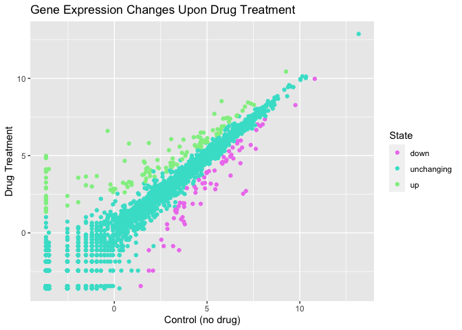
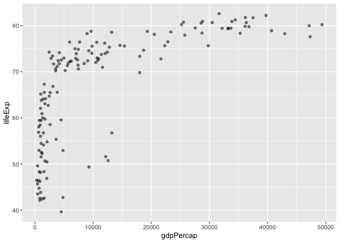
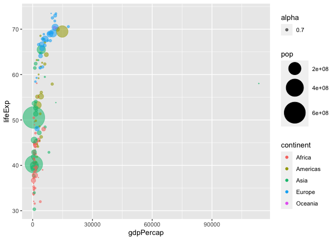
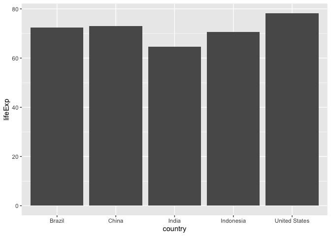

# Class 5 data visualization with ggplot2
Lena (A16420052)

## Using GGPLOT

The ggplot2 package needs to be installed as it does not come with R
“out of the box”.

We use the `install.package()` function to do this

``` r
head(cars)
```

      speed dist
    1     4    2
    2     4   10
    3     7    4
    4     7   22
    5     8   16
    6     9   10

To use ggplot I need to load it up before I can call any of the
functions in the package. I do this with the `library()` function.

``` r
library(ggplot2)
ggplot()
```


All ggplot figures have at least 3 things:

- data (the stuff we want to plot)
- aesthetic mapping (aes vales)
- geoms

``` r
ggplot(cars)+
  aes(x=speed, y=dist)+
  geom_point()+
  geom_smooth(method = "lm", se= FALSE)+
  labs(title="Speed and Stopping Distances of Cars", x="Speed (mph)",
       y= "Stopping Distance (ft)", subtitle = "cars are cool", 
       caption="Dataset:'cars'")+
  theme_bw()+ aes(lw=1, color="blue" , alpha=1)
```

    `geom_smooth()` using formula = 'y ~ x'


``` r
#geom_smooth adds trend line
#labs() label function
```

ggplot is not the only graphing system in R there are lots of others.
There is even “base R” graphics.

``` r
plot(cars)
```


Plot aesthetics using `aes()`

``` r
url <- "https://bioboot.github.io/bimm143_S20/class-material/up_down_expression.txt"
genes <- read.delim(url)
head(genes)
```

            Gene Condition1 Condition2      State
    1      A4GNT -3.6808610 -3.4401355 unchanging
    2       AAAS  4.5479580  4.3864126 unchanging
    3      AASDH  3.7190695  3.4787276 unchanging
    4       AATF  5.0784720  5.0151916 unchanging
    5       AATK  0.4711421  0.5598642 unchanging
    6 AB015752.4 -3.6808610 -3.5921390 unchanging

``` r
nrow(genes)
```

    [1] 5196

``` r
colnames(genes)
```

    [1] "Gene"       "Condition1" "Condition2" "State"     

``` r
table(genes$State)
```


          down unchanging         up 
            72       4997        127 

``` r
round(table(genes$State)/nrow(genes)*100, 2)
```


          down unchanging         up 
          1.39      96.17       2.44 

``` r
sum(genes$State=="up")
```

    [1] 127

``` r
url <- "https://bioboot.github.io/bimm143_S20/class-material/up_down_expression.txt"
genes <- read.delim(url)
#State tells us whether the difference in expression values between conditions is statistically significant 

library(ggplot2)
p <- ggplot(genes) + aes(x=Condition1, y=Condition2, col=State) + geom_point()
p + scale_colour_manual(values=c("violet","turquoise","lightgreen")) +labs(title= "Gene Expression Changes Upon Drug Treatment", x= "Control (no drug)", y="Drug Treatment")
```



``` r
url <- "https://raw.githubusercontent.com/jennybc/gapminder/master/inst/extdata/gapminder.tsv"
gapminder <- read.delim(url)
#gapminder_2007 dataset which contains the variables GDP per capita gdpPercap and life expectancy lifeExp for 142 countries in the year 2007
```

``` r
# install.packages("dplyr")  ## un-comment to install if needed
library(dplyr)
```


    Attaching package: 'dplyr'

    The following objects are masked from 'package:stats':

        filter, lag

    The following objects are masked from 'package:base':

        intersect, setdiff, setequal, union

``` r
gapminder_2007 <- gapminder %>% filter(year==2007)
ggplot(gapminder_2007) +
  aes(x=gdpPercap, y=lifeExp) + geom_point(alpha=0.5)
```



``` r
#alpha is for transparency
```

Coloring scheme based on the categorical data type of the variable
continent

``` r
ggplot(gapminder_2007) + 
  aes(x = gdpPercap, y = lifeExp, color = pop) +
  geom_point(alpha=0.8)
```


More variables for `aes()`

``` r
ggplot(gapminder_2007) +
  aes(x=gdpPercap, y=lifeExp, color=continent, size=pop) +
  geom_point(alpha=0.5)
```


``` r
#pop (in millions)
#continent variable (sorted by color)
```

Coloring the points by numeric variable population pop

``` r
ggplot(gapminder_2007) + 
  aes(x = gdpPercap, y = lifeExp, color = pop) +
  geom_point(alpha=0.8)
```


Adjusting point size

``` r
#set point size based on the population (size=pop) of each country we can use
ggplot(gapminder_2007) + 
  aes(x = gdpPercap, y = lifeExp, size = pop) +
  geom_point(alpha=0.5)
```


``` r
#scale_size_area() so point size are proportional with + operator
ggplot(gapminder_2007) + 
  geom_point(aes(x = gdpPercap, y = lifeExp,
                 size = pop), alpha=0.5) + 
  scale_size_area(max_size = 10)
```


1957 vs 2007

``` r
gapminder_1957 <- gapminder %>% filter(year==1957)
ggplot(gapminder_1957) +
  geom_point(aes(x=gdpPercap, y=lifeExp, size=pop, color=continent, alpha=0.7))+
  scale_size_area(max_size = 15)
```



1957 and 2007

``` r
gapminder_1957_and_2007 <- gapminder %>% filter(year==1957 | year==2007)

ggplot(gapminder_1957_and_2007) + 
  geom_point(aes(x = gdpPercap, y = lifeExp, color=continent,
                 size = pop), alpha=0.7) + 
  scale_size_area(max_size = 15) +
  facet_wrap(~year)
```


``` r
#facet_wrap(~year) layer to add both years
```

## Bar Charts

Create bar charts using `geom_col()` Fill bars with color using `fill`
aesthetic

Each category is represented by one bar with a height defined by each
numeric value. Good for comparing values among different groups

``` r
gapminder_top5 <- gapminder %>% 
  filter(year==2007) %>% 
  arrange(desc(pop)) %>% 
  top_n(5, pop)

gapminder_top5
```

            country continent year lifeExp        pop gdpPercap
    1         China      Asia 2007  72.961 1318683096  4959.115
    2         India      Asia 2007  64.698 1110396331  2452.210
    3 United States  Americas 2007  78.242  301139947 42951.653
    4     Indonesia      Asia 2007  70.650  223547000  3540.652
    5        Brazil  Americas 2007  72.390  190010647  9065.801

ggplot barchart

``` r
ggplot(gapminder_top5) +
  geom_col(aes(x=country, y=pop)) 
```


life expectancy of the five biggest countries by population in 2007

``` r
ggplot(gapminder_top5)+
  geom_col(aes(x=country, y=lifeExp))
```



Filling Bars with color

``` r
ggplot(gapminder_top5) + 
  geom_col(aes(x = country, y = pop, fill = continent))
```


``` r
#continent variable is a categorical variable; clear color scheme
#lifeExp is a numerical variable and has a range of color scheme
ggplot(gapminder_top5) + 
  geom_col(aes(x = country, y = pop, fill = lifeExp))
```


``` r
#fill is for how color scheme is
```

changing orders of bars

``` r
ggplot(gapminder_top5)+
  aes(x=reorder(country, -pop), y=pop, fill=gdpPercap)+geom_col()
```


same code different syntax

``` r
ggplot(gapminder_top5)+
  geom_col(aes(x=reorder(country, -pop), y=pop, fill=gdpPercap))
```


Flipping Bar Charts For clearer visualization using `coord_flip()`

``` r
head(USArrests)
```

               Murder Assault UrbanPop Rape
    Alabama      13.2     236       58 21.2
    Alaska       10.0     263       48 44.5
    Arizona       8.1     294       80 31.0
    Arkansas      8.8     190       50 19.5
    California    9.0     276       91 40.6
    Colorado      7.9     204       78 38.7

``` r
USArrests$State <- rownames(USArrests)
ggplot(USArrests)+
  geom_col(aes(x=reorder(State, Murder), y=Murder))+ coord_flip()
```


