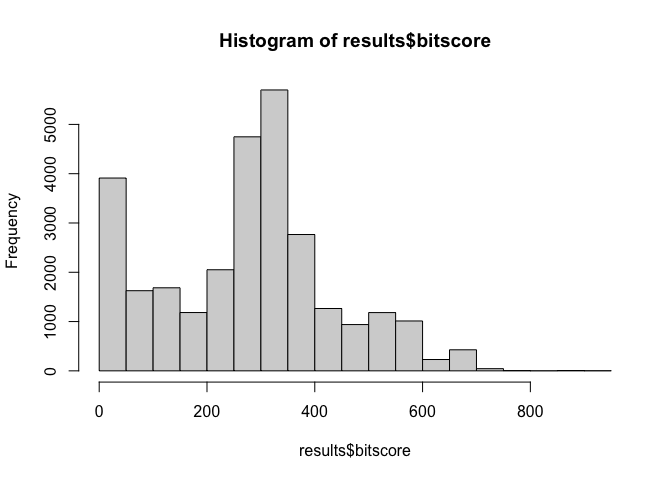
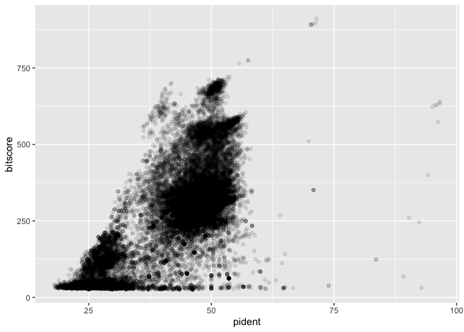
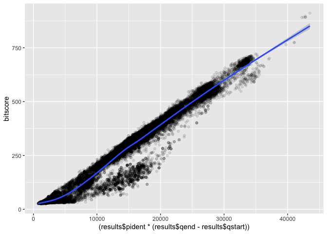

# UNIX
Lena (A16420052)

``` r
col_names<- c("qseqid", "sseqid", "pident", "length", "mismatch", "gapopen", "qstart", "qend", "sstart", "send", "evalue", "bitscore")

results<-read.delim("results.tsv", col.names = col_names)
```

Make a histogram of the \$bitscore values. You may want to set the
optional breaks to be a larger number (e.g. breaks=30).

``` r
hist(results$bitscore, breaks=30)
```



``` r
library(ggplot2)
ggplot(results, aes(pident, bitscore)) + geom_point(alpha=0.1) 
```



``` r
ggplot(results, aes((results$pident * (results$qend - results$qstart)), bitscore)) + geom_point(alpha=0.1) + geom_smooth()
```

    Warning: Use of `results$pident` is discouraged.
    ℹ Use `pident` instead.

    Warning: Use of `results$qend` is discouraged.
    ℹ Use `qend` instead.

    Warning: Use of `results$qstart` is discouraged.
    ℹ Use `qstart` instead.

    Warning: Use of `results$pident` is discouraged.
    ℹ Use `pident` instead.

    Warning: Use of `results$qend` is discouraged.
    ℹ Use `qend` instead.

    Warning: Use of `results$qstart` is discouraged.
    ℹ Use `qstart` instead.

    `geom_smooth()` using method = 'gam' and formula = 'y ~ s(x, bs = "cs")'


